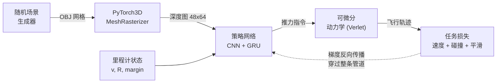
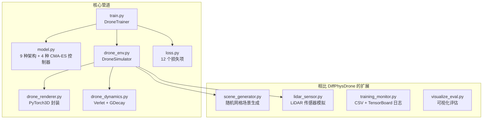

# DiffDrone-PyTorch3D

[](https://www.python.org/)
[](https://pytorch.org/)
[](https://pytorch3d.org/)
[](./LICENSE)

> **用梯度下降代替强化学习。** 让一架无人机仅凭一台深度相机，学会在密集障碍中自主穿梭——整条仿真管线（渲染 · 物理 · 控制）端到端可微分，策略直接从任务目标习得，无需强化学习、无需人类示教。

基于 PyTorch3D 对 DiffPhysDrone (Zhang et al., *Nature Machine Intelligence*, 2025) 的独立复现与扩展。本项目加入了 CMA-ES 超参优化、多传感器融合、动态障碍物和 10 种策略网络架构（9 种为原创扩展）。整个仿真管道（渲染、物理、控制）完全可微分，策略网络直接通过梯度下降从任务目标中学习——无需强化学习，无需人类示教。

[English version](./README_EN.md)

---

## 演示


*三种飞行场景（合成画面：RGB + 深度图）。从左到右：梯度裁剪策略穿越狭窄通道、基线策略穿梭分散障碍物、CMA-ES 衰减策略通过密集簇生障碍群。*

---

## 关键指标

| 指标 | 数值 | 说明 |
|------|------|------|
| **SR** | **83.13%** | 严格成功率——到达目标且全程无碰撞 |
| **RR** | **93.75%** | 到达率——到达目标（可能发生轻微接触） |
| **CFR** | **88.13%** | 无碰撞率——全程未接触任何障碍物 |
| **平均速度** | **1.09 m/s** | 成功 episode 的平均飞行速度 |

*最佳模型 (exp21_grad_clip_goal)，基于 5 个随机种子评估。完整结果见[实验](#实验)。*

---

## 目录

- [DiffDrone-PyTorch3D](#diffdrone-pytorch3d)
  - [演示](#演示)
  - [关键指标](#关键指标)
  - [目录](#目录)
  - [这是什么？](#这是什么)
  - [快速开始](#快速开始)
  - [系统架构](#系统架构)
    - [可微分训练管道](#可微分训练管道)
    - [系统模块](#系统模块)
  - [核心创新](#核心创新)
  - [实验](#实验)
    - [汇总表（节选）](#汇总表节选)
    - [关键发现](#关键发现)
  - [路线图与远期展望](#路线图与远期展望)
  - [环境安装](#环境安装)
  - [训练与评估](#训练与评估)
    - [训练模型](#训练模型)
    - [评估与可视化](#评估与可视化)
  - [项目结构](#项目结构)
  - [参与贡献](#参与贡献)
  - [引用与相关工作](#引用与相关工作)
    - [主要引用](#主要引用)
    - [相关工作](#相关工作)
  - [许可证](#许可证)
  - [关于作者](#关于作者)
---

## 这是什么？

**DiffDrone-PyTorch3D** 训练一个神经网络，让无人机仅凭前视深度相机在障碍物密集的环境中自主飞行。整个仿真器——3D 渲染、气动力学、碰撞检测——都是可微分的，策略网络直接通过梯度下降从任务目标中学习。

**核心意义。** 传统无人机导航依赖强化学习，需要数百万次试错交互。将仿真管道变为端到端可微分后，损失信号（"撞了吗？"）可以直接沿计算图反向传播，穿过物理引擎和渲染器，直达策略网络参数。这意味着仅需几千个训练 episode 就能完成学习，样本效率远高于强化学习方法，也避免了仿真与现实的策略梯度鸿沟。

**与 DiffPhysDrone 的关系。** 核心算法——GDecay 梯度衰减、Verlet 积分动力学、端到端训练循环——源自 DiffPhysDrone (Zhang et al., 2025)。本项目使用纯 PyTorch3D **重新实现**了该管道（无需 CUDA 编译），并在此基础上加入了大量扩展，详见[核心创新](#核心创新)一节。

---

## 快速开始

前提条件：Python 3.10+, CUDA GPU。完整环境配置见[环境安装](#环境安装)。

```bash
# 克隆并安装依赖
git clone https://github.com/kirkchinese/Diffable_Drone_Pytorch3D.git
cd Diffable_Drone_Pytorch3D
pip install -r requirements.txt

mkdir -p ./checkpoints/thesis/exp21_grad_clip_goal
wget https://github.com/kirkchinese/Diffable_Drone_Pytorch3D/releases/download/v0.1.0/exp21_grad_clip_goal_best_ar.pth \
    -O ./checkpoints/thesis/exp21_grad_clip_goal/best_ar.pth

# 或先自行训练（见训练一节），再运行评估：
python visualize_eval.py \
    --checkpoint ./checkpoints/thesis/exp21_grad_clip_goal/best_ar.pth \
    --model_type bigger --num_episodes 4 --random_scene \
    --output_dir ./viz_results/demo --gpu 0

# 在 viz_results/demo/ 下查看生成的视频和轨迹图
```

---

## 系统架构

### 可微分训练管道



从左到右：场景生成、深度渲染、策略推理、物理仿真、损失计算。虚线表示梯度反向传播穿过整条计算图——从损失直达策略网络参数。

### 系统模块



---

## 核心创新

相比原 DiffPhysDrone 项目的扩展：

| 维度 | DiffPhysDrone (Zhang et al.) | 本项目 |
|------|------------------------------|--------|
| **渲染** | CUDA 自定义光线投射（需编译） | PyTorch3D MeshRasterizer（纯 Python） |
| **策略架构** | 1 种 (CNN + GRU) | 10 种模型：增强版、自适应、高分辨率、注意力、多尺度、残差、轻量、LiDAR、融合 + 原始模型 |
| **传感器模态** | 仅深度 | 深度、LiDAR、深度+LiDAR 融合 |
| **超参优化** | 人工调参 | CMA-ES 四种模式：衰减控制、损失系数引导、元控制器、损失网络 |
| **场景生成** | CUDA 参数化几何体 | 随机网格生成器，支持簇生/接地两种障碍物分布模式 |
| **障碍物** | 仅静态 | 静态 + 动态移动障碍物 |
| **多机支持** | 基础 | 分组渲染 + 张量拼接快速路径（28ms 开销优化） |
| **梯度稳定性** | GDecay | GDecay + 梯度裁剪 + EMA 影子参数 |
| **训练基础设施** | 单文件脚本 | 类封装训练器、CSV 日志、TensorBoard、checkpoint 管理 |

---

## 实验

共 22 组实验，覆盖 5 个研究维度（损失函数、CMA-ES 模式、传感器模态、模型架构、训练稳定性）。每组 5 个随机种子，每种子评估 80 episode。

### 汇总表（节选）

| 实验 | SR (%) | RR (%) | CFR (%) | 速度 (m/s) |
|------|--------|--------|---------|-------------|
| exp21_grad_clip_goal | **83.13** ± 4.74 | **93.75** ± 4.42 | 88.13 ± 3.42 | 1.09 ± 0.07 |
| exp01_baseline_mse | 74.38 ± 4.63 | 83.75 ± 5.59 | 88.12 ± 2.61 | 1.11 ± 0.04 |
| exp05_cmaes_guide | 75.00 ± 6.25 | **99.38** ± 1.40 | 75.00 ± 6.25 | 1.08 ± 0.02 |
| exp04_cmaes_decay | 75.00 ± 6.63 | 88.13 ± 8.67 | 84.38 ± 3.83 | 1.33 ± 0.08 |
| exp09_sensor_fusion | 75.00 ± 5.85 | 80.63 ± 5.13 | 88.75 ± 6.09 | 1.27 ± 0.08 |
| exp10_model_attention | 72.50 ± 9.48 | 83.13 ± 11.18 | 85.63 ± 2.79 | 1.29 ± 0.11 |
| exp06_cmaes_meta | 67.50 ± 4.20 | 74.37 ± 5.59 | 85.62 ± 6.09 | **2.09** ± 0.04 |

SR = 严格成功率（到达且无碰撞）。RR = 到达率。CFR = 无碰撞率。完整表格见 `viz_results/thesis_eval/summary_aggregated.csv`。

### 关键发现

- **梯度裁剪 + 目标达成** (exp21) 取得最佳严格成功率 83.13%，相比基线 74.38% 有显著提升
- **CMA-ES 损失系数引导** (exp05) 将到达率推至 99.38%，证明进化算法能有效搜索损失函数权重空间
- **CMA-ES 元控制器** (exp06) 以安全性为代价换取速度，平均速度达 2.09 m/s，为所有实验中最高
- **传感器融合** (exp09) 和 **注意力机制** (exp10) 在增加系统复杂度的同时维持了基线水平性能
- **损失网络** (exp07) 未能收敛 (SR 仅 1.25%)，说明端到端可微分训练对损失函数的设计高度敏感

---

## 路线图与远期展望

### 近期

- **真机部署**：将策略迁移到小型四旋翼平台，验证仿真到现实（sim-to-real）的迁移能力。
- **外部基线对比**：在同场景下引入 PPO/SAC 与 EGO-Planner，为绝对性能提供更充分的参照。
- **课程学习**：设计从简单到复杂的渐进训练方案，进一步缓解训练后期的性能退化。
- **Transformer 时序建模**：以自注意力替代 GRU，捕获更长时间范围的状态依赖。

### 远期：从「会飞」到「会走」——迁移到腿足机器人

本项目验证了可微物理训练在无人机上的可行性。更长远的愿景，是把同一范式推广到**四足 / 双足 / 人形机器人**的运动控制。这里有一个根本性的数学难点，值得开诚布公地讲清楚：

**为什么无人机「容易」、腿足机器人「难」。** 在本框架中，无人机被近似为一个带姿态的**质点**，从控制量（推力）到加速度的映射是光滑的，整条计算图处处可微，梯度能够干净地从损失回传到策略。腿足机器人则不同：

1. **不再是质点，而是浮动基多刚体系统。** 一台四足约有 6 自由度浮动基 + 12 关节自由度，人形可达 30+ 自由度，动力学由完整的惯量矩阵描述：$M(q)\ddot{q} + h(q,\dot{q}) = S^\top\tau + J_c^\top\lambda$。维度大幅升高，但这一层仍是**光滑可微**的——现代刚体动力学库（Pinocchio、MuJoCo MJX、Brax）已能提供解析导数。

2. **真正的难点是接触。** 行走的本质是不断建立与断开足-地接触。接触受**互补约束**（足要么着地有力、要么离地无力）与**摩擦锥**支配，本质上是非光滑的；每一次落足 / 抬足都是一次离散模式切换，使整个系统成为**混合动力系统**。其后果是：穿过接触的梯度可能不连续、在支撑相趋于零、在刚性接触处爆炸，损失曲面也随之非光滑——这正是朴素可微物理在接触任务上失效的根源。

3. **欠驱动与平衡。** 无人机在推力方向上完全驱动、天然可控；腿足机器人的浮动基没有直接驱动，只能借助接触力维持平衡（质心 / 捕获点动力学），控制难度更高。

**可行的攻关路径（让它不只是空想）：**

- **光滑化接触**：用软接触（弹簧-阻尼 / 罚函数）或解析光滑的可微接触求解器（Nimble、Dojo、Brax-spring）替代硬 LCP，使接触处处可微。
- **降阶模板模型**：不直接对整机求导，而是对**质心动力学 / 单刚体（SRBM）/ 弹簧负载倒立摆（SLIP）**等降阶模型做可微规划，下层交由全身控制器跟踪——这正面回应了「整机模型太复杂」的顾虑。
- **一阶 + 零阶混合梯度**：把解析梯度与强化学习式的零阶估计相结合（如 SHAC 短时域 actor-critic、随机化光滑），在接触导致的梯度病态下仍能稳定下降。

简言之，从无人机到腿足机器人，挑战的重心由「高维但光滑」转向「接触带来的非光滑与梯度病态」。本项目积累的端到端可微管线、梯度稳定化方案（GCGL）与训练基础设施，正是迈向这一目标的起点。

---

## 环境安装

```bash
# 创建虚拟环境
conda create -n diffdrone python=3.10 -y
conda activate diffdrone

# 安装 PyTorch（根据你的 CUDA 版本调整）
pip install torch==2.4.1 --index-url https://download.pytorch.org/whl/cu118

# 安装项目依赖
pip install -r requirements.txt
```

运行要求：Python 3.10+, CUDA GPU (CUDA 11.8/12.1), 推荐 8GB+ 显存。

---

## 训练与评估

### 训练模型

```bash
# 单机避障基线
python train.py @configs/thesis_base.args --save_dir ./checkpoints/exp_baseline --gpu 0

# 多机编队（每组 8 架无人机，动态障碍物）
python train.py @configs/multi_agent.args --save_dir ./checkpoints/exp_multi --gpu 0

# CMA-ES 超参优化
python train.py @configs/single_agent-CMA-ES.args --save_dir ./checkpoints/exp_cmaes --gpu 0
```

配置文件 (`configs/*.args`) 定义了全部训练超参。可在命令行覆盖任意参数，如：`--lr 5e-4 --batch_size 64`。

### 评估与可视化

```bash
# 生成飞行视频和轨迹图
python visualize_eval.py \
    --checkpoint ./checkpoints/exp_baseline/best_ar.pth \
    --model_type bigger --num_episodes 4 --random_scene \
    --output_dir ./viz_results/exp_baseline_eval --gpu 0

# 多种子批量评估
python testscript/multi_seed_eval.py --exp_dir ./checkpoints/exp_baseline --n_seeds 5
```

每个 episode 的输出文件：`rgb.mp4`, `depth.mp4`, `composite.mp4`, `trajectory.png`, `log.csv`。

---

## 项目结构

```
.
├── train.py                  # 主训练脚本 (DroneTrainer 类)
├── model.py                  # 策略网络 + CMA-ES 控制器
├── drone_env.py              # 可微分无人机仿真环境
├── drone_dynamics.py         # Verlet 积分动力学 + GDecay
├── drone_renderer.py         # PyTorch3D 渲染器封装
├── drone_renderer_dynamic.py # 动态障碍物渲染
├── scene_generator.py        # 随机网格场景生成器
├── lidar_sensor.py           # 可微分 LiDAR 传感器
├── loss.py                   # 12 项复合损失函数
├── navigation_utils.py       # 统一策略推理适配器
├── training_monitor.py       # CSV/TensorBoard/tqdm 日志
├── visualize_eval.py         # 可视化评估与视频生成
├── configs/                  # 训练配置文件 (.args)
├── checkpoints/              # 训练模型权重 (gitignored)
├── data/                     # 3D 网格资源 (无人机、障碍物等)
├── testscript/               # 批量评估与分析脚本
└── viz_results/              # 可视化输出 (视频、图表、CSV)
```

## 参与贡献

欢迎提交 Bug 报告和 Pull Request。如有重大修改，请先开 Issue 讨论。开发入门可参考 `configs/` 中的实验配置和 `testscript/` 中的评估工具。

---

## 引用与相关工作

### 主要引用

本项目基于 DiffPhysDrone 构建。如果在研究中使用了本代码，请引用：

```bibtex
@article{zhang2025learning,
  title   = {Learning vision-based agile flight via differentiable physics},
  author  = {Zhang, Yuang and Hu, Yu and Song, Yunlong and Zou, Danping and Lin, Weiyao},
  journal = {Nature Machine Intelligence},
  year    = {2025},
  publisher = {Nature Publishing Group}
}
```

### 相关工作

**可微分仿真**在软体动力学 (Hu et al., 2020)、刚体物理 (Freeman et al., 2021) 和无人机控制领域均有探索。DiffPhysDrone 首次展示了端到端可微分训练在视觉无人机飞行上的可行性，本项目提供了基于纯 PyTorch3D 的开源实现和扩展。

**视觉无人机导航**涵盖了经典方法 (Floreano & Wood, 2015)、深度强化学习 (Kaufmann et al., 2023) 和模仿学习 (Loquercio et al., 2021)。可微分物理提供了另一条互补路线：样本高效的策略学习，且不存在仿真到现实的策略梯度鸿沟。

---

## 许可证

本项目采用 [GNU General Public License v3.0](https://www.gnu.org/licenses/gpl-3.0.html) 许可证。详见 [LICENSE](./LICENSE)。

---

## 关于作者

**徐路 / Xu Lu** —— 浙大城市学院 自动化专业（先进控制方向）。研究兴趣在可微物理、机器人学习与视觉导航的交叉地带。

本项目是我目前工程与研究能力的集中体现：作为独立开发者，从零搭建了这套端到端可微的无人机仿真-训练管线，复现并扩展了一篇 *Nature Machine Intelligence* 论文，并定位、用 GCGL 方案缓解了训练后期的性能退化（稳定到达指数 +16.7%，5 种子成功率 +8.7pp）。从控制建模、可微仿真到深度学习与系统工程，是一条完整的链路。

目前正在寻找**机器人 / 强化学习 / 具身智能**方向的工程或研究岗位，欢迎交流与内推。

- GitHub: [@kirkchinese](https://github.com/kirkchinese)
- Email: kirkchinese@gmail.com