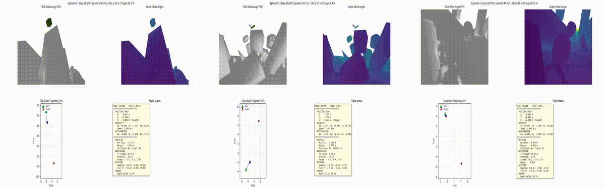
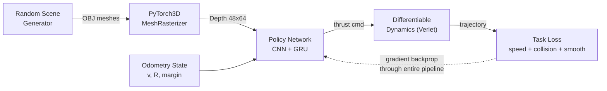
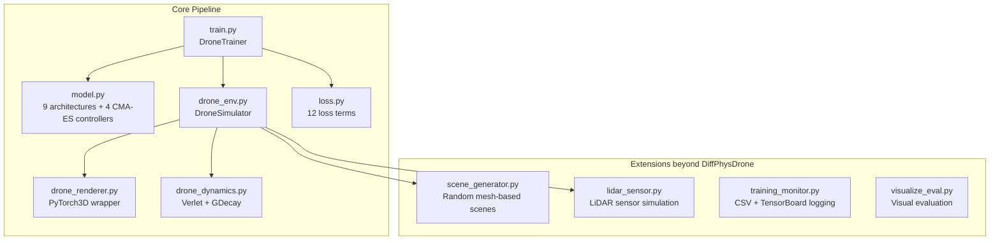

# DiffDrone-PyTorch3D

[](https://www.python.org/)
[](https://pytorch.org/)
[](https://pytorch3d.org/)
[](./LICENSE)

> **Gradient descent instead of reinforcement learning.** A drone learns to weave through dense clutter from a single depth camera — the entire simulation pipeline (rendering · physics · control) is end-to-end differentiable, so the policy is learned straight from task objectives, with no RL and no human demonstrations.

A PyTorch3D-based reimplementation of DiffPhysDrone (Zhang et al., *Nature Machine Intelligence*, 2025). Extends the original with CMA-ES optimization, multi-sensor fusion, dynamic obstacles, and 10 policy network architectures (9 beyond the original). Train vision-based drone navigation entirely through gradient descent — no RL, no human demonstrations.

[中文版本](./README.md)

---

## Demo



*Three flight scenarios (composite: RGB + Depth). Left to right: gradient-clip policy navigating tight corridors, baseline policy weaving through scattered obstacles, CMA-ES decay policy threading through dense clusters.*

---

## Key Results

| Metric | Value | Description |
|--------|-------|-------------|
| **SR** | **83.13%** | Strict success rate — reached target without collision |
| **RR** | **93.75%** | Arrival rate — reached target (may have minor contact) |
| **CFR** | **88.13%** | Collision-free rate — flight without any obstacle contact |
| **Avg Speed** | **1.09 m/s** | Average flight velocity over successful episodes |

*Best model (exp21_grad_clip_goal), 5-seed evaluation. See [Experiments](#experiments) for full results.*

---

## Table of Contents

- [DiffDrone-PyTorch3D](#diffdrone-pytorch3d)
  - [Demo](#demo)
  - [Key Results](#key-results)
  - [Table of Contents](#table-of-contents)
  - [What is This?](#what-is-this)
  - [Quick Start](#quick-start)
  - [Architecture](#architecture)
    - [Differentiable Training Pipeline](#differentiable-training-pipeline)
    - [System Modules](#system-modules)
  - [Key Innovations](#key-innovations)
  - [Experiments](#experiments)
    - [Summary Table (selected)](#summary-table-selected)
    - [Key Findings](#key-findings)
  - [Roadmap \& Long-Term Vision](#roadmap--long-term-vision)
  - [Installation](#installation)
  - [Training \& Evaluation](#training--evaluation)
    - [Train a Model](#train-a-model)
    - [Evaluate and Visualize](#evaluate-and-visualize)
  - [Project Structure](#project-structure)
  - [Contributing](#contributing)
  - [Citation \& Related Work](#citation--related-work)
    - [Primary Reference](#primary-reference)
    - [Related Work](#related-work)
  - [License](#license)
  - [About the Author](#about-the-author)

---

## What is This?

**DiffDrone-PyTorch3D** trains a neural network to fly a drone through cluttered environments using only a front-facing depth camera. The entire simulator — 3D rendering, aerodynamics, collision detection — is *differentiable*, so the policy learns directly from task objectives via gradient descent.

**Why this matters.** Traditional drone navigation uses reinforcement learning, requiring millions of trial-and-error episodes. By making the simulation end-to-end differentiable, gradients flow from the loss signal ("did I crash?") all the way back through physics and rendering to the policy network. This achieves sample-efficient learning with only a few thousand episodes — orders of magnitude fewer than RL — and avoids the sim-to-real policy gradient gap inherent in RL-based approaches.

**Relationship to DiffPhysDrone.** The core algorithm pipeline — GDecay gradient damping, Verlet-integrated dynamics, and end-to-end training — originates from DiffPhysDrone (Zhang et al., 2025). This project **reimplements** that pipeline in pure PyTorch3D (no CUDA compilation required) and adds substantial extensions detailed in [Key Innovations](#key-innovations).

---

## Quick Start

Prerequisites: Python 3.10+, CUDA GPU. See [Installation](#installation) for full setup.

```bash
# Clone and install
git clone https://github.com/kirkchinese/Diffable_Drone_Pytorch3D.git
cd Diffable_Drone_Pytorch3D
pip install -r requirements.txt

mkdir -p ./checkpoints/thesis/exp21_grad_clip_goal
wget https://github.com/kirkchinese/Diffable_Drone_Pytorch3D/releases/download/v0.1.0/exp21_grad_clip_goal_best_ar.pth \
    -O ./checkpoints/thesis/exp21_grad_clip_goal/best_ar.pth

# Or train your own first (see Training section), then run evaluation:
python visualize_eval.py \
    --checkpoint ./checkpoints/thesis/exp21_grad_clip_goal/best_ar.pth \
    --model_type bigger --num_episodes 4 --random_scene \
    --output_dir ./viz_results/demo --gpu 0

# Watch the generated videos in viz_results/demo/
```

---

## Architecture

### Differentiable Training Pipeline



Left to right: scene generation, depth rendering, policy inference, physics simulation, loss computation. The dashed line represents the gradient flow backpropagating through the entire pipeline.

### System Modules



---

## Key Innovations

Compared to the original DiffPhysDrone, this project adds:

| Dimension | DiffPhysDrone (Zhang et al.) | This Project |
|-----------|------------------------------|--------------|
| **Rendering** | CUDA custom raycasting (requires compilation) | PyTorch3D MeshRasterizer (pure Python) |
| **Policy architectures** | 1 (CNN + GRU) | 10 models: bigger, adaptive, high-res, attention, multi-scale, residual, lightweight, LiDAR, fusion + original |
| **Sensor modalities** | Depth only | Depth, LiDAR, Depth+LiDAR fusion |
| **Hyperparameter optimization** | Manual tuning | CMA-ES in 4 modes: decay control, loss coefficient guide, meta-controller, loss network |
| **Scene generation** | Parametric primitives in CUDA | Random mesh-based generator with cluster/ground modes |
| **Obstacles** | Static only | Static + dynamic moving obstacles |
| **Multi-drone support** | Basic | Per-group rendering with fast-path tensor concatenation |
| **Gradient stability** | GDecay | GDecay + gradient clipping + EMA shadow parameters |
| **Training infrastructure** | Single script | Class-encapsulated trainer, CSV logging, TensorBoard, checkpoint management |

---

## Experiments

22 experiments across 5 dimensions. Each evaluated with 5 random seeds (80 episodes per seed).

### Summary Table (selected)

| Experiment | SR (%) | RR (%) | CFR (%) | Speed (m/s) |
|-----------|--------|--------|---------|--------------|
| exp21_grad_clip_goal | **83.13** ± 4.74 | **93.75** ± 4.42 | 88.13 ± 3.42 | 1.09 ± 0.07 |
| exp01_baseline_mse | 74.38 ± 4.63 | 83.75 ± 5.59 | 88.12 ± 2.61 | 1.11 ± 0.04 |
| exp05_cmaes_guide | 75.00 ± 6.25 | **99.38** ± 1.40 | 75.00 ± 6.25 | 1.08 ± 0.02 |
| exp04_cmaes_decay | 75.00 ± 6.63 | 88.13 ± 8.67 | 84.38 ± 3.83 | 1.33 ± 0.08 |
| exp09_sensor_fusion | 75.00 ± 5.85 | 80.63 ± 5.13 | 88.75 ± 6.09 | 1.27 ± 0.08 |
| exp10_model_attention | 72.50 ± 9.48 | 83.13 ± 11.18 | 85.63 ± 2.79 | 1.29 ± 0.11 |
| exp06_cmaes_meta | 67.50 ± 4.20 | 74.37 ± 5.59 | 85.62 ± 6.09 | **2.09** ± 0.04 |

SR = Strict success (reach target, zero collisions). RR = Arrival rate. CFR = Collision-free rate. Full table in `viz_results/thesis_eval/summary_aggregated.csv`.

### Key Findings

- **Gradient clipping + goal reaching** (exp21) achieves the best SR at 83.13%, compared to baseline 74.38%
- **CMA-ES loss coefficient guide** (exp05) drives arrival rate to 99.38% by evolving per-term loss weights
- **CMA-ES meta-controller** (exp06) trades safety for speed, reaching 2.09 m/s average
- **Sensor fusion** (exp09) and **attention** (exp10) maintain baseline-level performance with additional sensor/model complexity
- **Loss network** (exp07) fails to converge (SR 1.25%), confirming that end-to-end differentiable training is sensitive to loss function design

---

## Roadmap & Long-Term Vision

### Near-Term

- **Real-world deployment**: transfer the policy to a small quadrotor and validate sim-to-real.
- **External baselines**: add same-scene PPO/SAC and EGO-Planner comparisons for an absolute performance reference.
- **Curriculum learning**: progressive simple-to-complex training to further mitigate late-stage degradation.
- **Transformer temporal modeling**: replace the GRU with self-attention to capture longer-range state dependencies.

### Long-Term: From Flying to Walking — Extending to Legged Robots

This project shows that differentiable-physics training works for drones. The longer-term vision is to carry the same paradigm over to **quadruped / biped / humanoid** locomotion. There is a fundamental mathematical obstacle here worth stating plainly:

**Why a drone is "easy" and a legged robot is "hard."** In this framework a drone is approximated as a **point mass** with attitude; the map from control (thrust) to acceleration is smooth, the whole computation graph is differentiable everywhere, and gradients flow cleanly from the loss back to the policy. A legged robot is different:

1. **No longer a point mass, but a floating-base multibody system.** A quadruped has a 6-DOF floating base + ~12 joint DOF; a humanoid reaches 30+ DOF, governed by the full manipulator equation $M(q)\ddot{q} + h(q,\dot{q}) = S^\top\tau + J_c^\top\lambda$. The dimensionality jumps, but this layer is still **smooth and differentiable** — modern rigid-body libraries (Pinocchio, MuJoCo MJX, Brax) already provide analytic derivatives.

2. **The real difficulty is contact.** Walking is fundamentally about making and breaking foot-ground contact. Contact is governed by **complementarity constraints** (a foot is either in contact with force, or separated with none) and a **friction cone** — both non-smooth — and every touchdown/liftoff is a discrete mode switch, making the system a **hybrid dynamical system**. As a result, gradients through contact can be discontinuous, vanish during stance, or explode at stiff contacts, and the loss landscape becomes non-smooth. This is exactly where naive differentiable physics breaks down.

3. **Underactuation and balance.** A drone is fully actuated along its thrust axis and inherently controllable; a legged robot's floating base has no direct actuation and must balance purely through contact forces (centroidal / capture-point dynamics).

**Tractable attack routes (so this stays grounded, not wishful):**

- **Smoothed contact**: replace hard LCP with soft contact (spring-damper / penalty) or analytically smoothed differentiable contact solvers (Nimble, Dojo, Brax-spring) so contact is differentiable everywhere.
- **Reduced-order templates**: rather than differentiating the full robot, do differentiable planning on a **centroidal / single-rigid-body (SRBM) / spring-loaded inverted pendulum (SLIP)** model and let a whole-body controller track it — a direct answer to the "the full model is too complex" concern.
- **First-order + zeroth-order hybrid gradients**: combine analytic gradients with RL-style zeroth-order estimates (e.g., SHAC short-horizon actor-critic, randomized smoothing) to descend reliably despite contact-induced gradient pathologies.

In short, moving from drones to legged robots shifts the challenge from "high-dimensional but smooth" to "non-smooth and gradient-pathological because of contact." The end-to-end differentiable pipeline, gradient-stabilization (GCGL), and training infrastructure built here are the foundation for taking that step.

---

## Installation

```bash
# Create environment
conda create -n diffdrone python=3.10 -y
conda activate diffdrone

# Install PyTorch (adjust CUDA version as needed)
pip install torch==2.4.1 --index-url https://download.pytorch.org/whl/cu118

# Install project dependencies
pip install -r requirements.txt
```

Requirements: Python 3.10+, CUDA-capable GPU (tested on CUDA 11.8/12.1), 8GB+ VRAM recommended.

---

## Training & Evaluation

### Train a Model

```bash
# Single-agent baseline
python train.py @configs/thesis_base.args --save_dir ./checkpoints/exp_baseline --gpu 0

# Multi-agent (8 drones per group, dynamic obstacles)
python train.py @configs/multi_agent.args --save_dir ./checkpoints/exp_multi --gpu 0

# CMA-ES hyperparameter optimization
python train.py @configs/single_agent-CMA-ES.args --save_dir ./checkpoints/exp_cmaes --gpu 0
```

Config files (`configs/*.args`) define all training hyperparameters. Override any parameter on the command line: `--lr 5e-4 --batch_size 64`.

### Evaluate and Visualize

```bash
# Generate videos and trajectory plots
python visualize_eval.py \
    --checkpoint ./checkpoints/exp_baseline/best_ar.pth \
    --model_type bigger --num_episodes 4 --random_scene \
    --output_dir ./viz_results/exp_baseline_eval --gpu 0

# Batch evaluation with multiple seeds
python testscript/multi_seed_eval.py --exp_dir ./checkpoints/exp_baseline --n_seeds 5
```

Output per episode: `rgb.mp4`, `depth.mp4`, `composite.mp4`, `trajectory.png`, `log.csv`.

---

## Project Structure

```
.
├── train.py                  # Main training script (DroneTrainer class)
├── model.py                  # Policy networks + CMA-ES controllers
├── drone_env.py              # Differentiable drone simulation environment
├── drone_dynamics.py         # Verlet-integrated dynamics + GDecay
├── drone_renderer.py         # PyTorch3D renderer wrapper
├── drone_renderer_dynamic.py # Dynamic obstacle rendering
├── scene_generator.py        # Random mesh-based scene composer
├── lidar_sensor.py           # Differentiable LiDAR simulation
├── loss.py                   # 12-term composite loss function
├── navigation_utils.py       # Unified policy inference adapter
├── training_monitor.py       # CSV/TensorBoard/tqdm logging
├── visualize_eval.py         # Visual evaluation and video generation
├── configs/                  # Training configuration files (.args)
├── checkpoints/              # Trained model checkpoints (gitignored)
├── data/                     # 3D meshes (drone, obstacles, samples)
├── testscript/               # Batch evaluation and analysis scripts
└── viz_results/              # Visualization outputs (videos, plots, CSVs)
```

## Contributing

Bug reports and pull requests are welcome. For major changes, please open an issue first to discuss what you would like to change. See `configs/` for experiment configurations and `testscript/` for evaluation utilities to get started.

---

## Citation & Related Work

### Primary Reference

This project builds upon DiffPhysDrone. If you use this code in your research, please cite:

```bibtex
@article{zhang2025learning,
  title   = {Learning vision-based agile flight via differentiable physics},
  author  = {Zhang, Yuang and Hu, Yu and Song, Yunlong and Zou, Danping and Lin, Weiyao},
  journal = {Nature Machine Intelligence},
  year    = {2025},
  publisher = {Nature Publishing Group}
}
```

### Related Work

**Differentiable simulation** has been explored in soft-body dynamics (Hu et al., 2020), rigid-body physics (Freeman et al., 2021), and drone control. DiffPhysDrone demonstrated end-to-end differentiable training for vision-based flight, and this project provides an open-source PyTorch3D implementation with extensions.

**Vision-based drone navigation** spans classical approaches (Floreano & Wood, 2015), deep reinforcement learning (Kaufmann et al., 2023), and imitation learning (Loquercio et al., 2021). Differentiable physics offers a complementary paradigm: sample-efficient learning without a simulator gap.

---

## License

This project is licensed under the [GNU General Public License v3.0](https://www.gnu.org/licenses/gpl-3.0.html). See [LICENSE](./LICENSE) for details.

---

## About the Author

**Xu Lu (徐路)** — Automation (advanced control), Hangzhou City University. Interested in the intersection of differentiable physics, robot learning, and vision-based navigation.

This project is the most complete expression of my engineering and research ability so far: as a solo developer I built this end-to-end differentiable drone simulation-and-training pipeline from scratch, reproduced and extended a *Nature Machine Intelligence* paper, and diagnosed and mitigated its late-stage training degradation with the GCGL method (+16.7% stable-arrival index, +8.7pp 5-seed success rate). It spans the full stack — from control modeling and differentiable simulation to deep learning and systems engineering.

I'm currently looking for **robotics / reinforcement learning / embodied AI** engineering or research roles. Always happy to connect.

- GitHub: [@kirkchinese](https://github.com/kirkchinese)
- Email: kirkchinese@gmail.com
