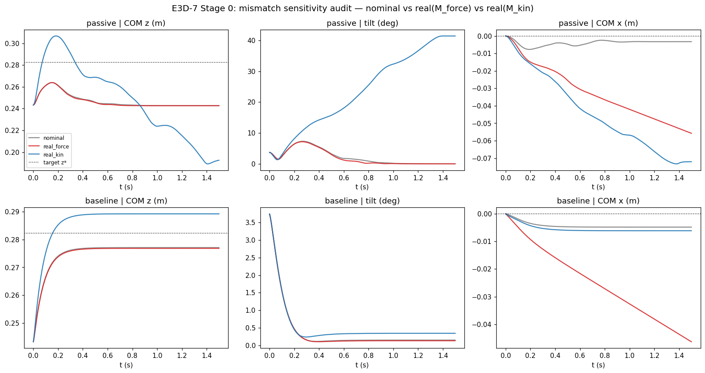
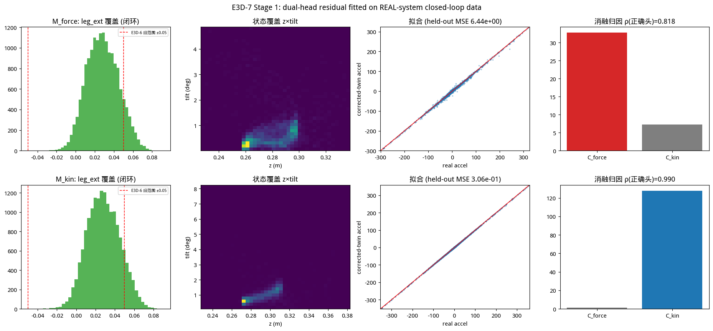
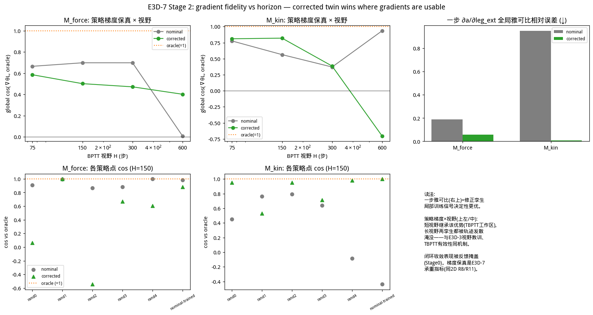
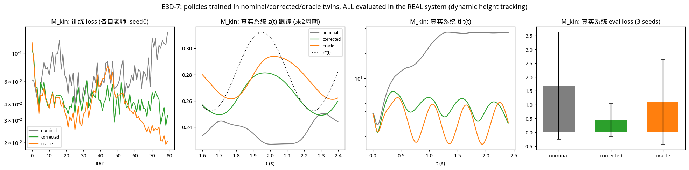
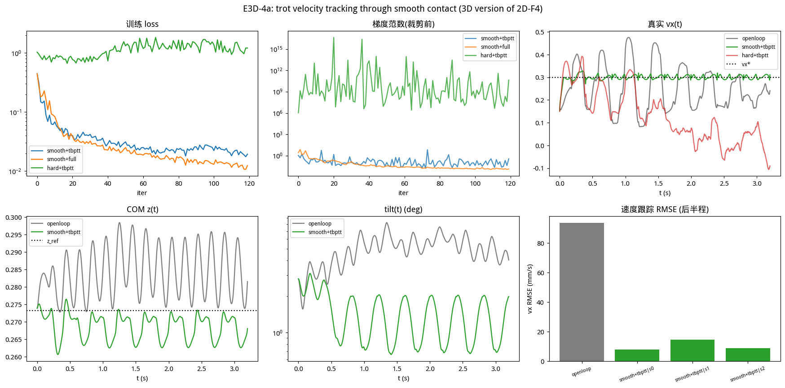

# 3D 迁移阶段研究笔记：Unitree Go2 可微数字孪生

> 版本：3D 阶段 · E3D-0 … E3D-3（2026-06-09）+ E3D-6/E3D-7（2026-06-11）· 配套代码：[`models/`](../models/)、[`dynamics/`](../dynamics/)、[`scripts/`](../scripts/)、[`parameters/`](../parameters/)、[`figures/`](../figures/)
> 复现：`conda activate pytorch`；E3D-0 `python scripts/{convert_dae_to_obj,emit_model_summary,render_standing_pose}.py`；E3D-1 `python scripts/e3d1_floating_base_checks.py`；E3D-2 `python scripts/e3d2_contact_checks.py --device cuda:0`；E3D-3 `python scripts/e3d3_static_audit.py` + `python scripts/e3d3_standing_train.py --device cuda:0`；E3D-6 `python scripts/e3d6_channel_matching.py` + `python scripts/e3d6_dualhead_routing.py`（float64/CPU）；E3D-7 依次 `python scripts/e3d7_mismatch_audit.py` → `e3d7_fit_residual.py` → `e3d7_grad_fidelity.py` → `e3d7_transfer.py --mismatches kin`
> 承接 2D 阶段结论见 [`../research_note.md`](../research_note.md)。证据等级沿用：〔代码〕〔论文〕〔推导〕〔实验〕〔假设/猜想〕。

本阶段把 2D 平面四足建模迁移到 **3D Unitree Go2 数字机体**。与之前不同，本阶段的核心要求是
**整条链路（运动学 + 渲染）全部可微**，并基于 PyTorch / PyTorch3D **自建可微数字孪生**，
而不是接入一个黑箱仿真器。本笔记记录第一步 **E3D-0：模型读取 + 可微数字孪生骨架**。

---

## 0. 速览（TL;DR）

**一句话**：用宇树官方 URDF（`go2_description`）构建了一个**端到端可微**的 Go2 数字孪生——
URDF→运动学树→刚体前向运动学（FK）→逐连杆网格刚性蒙皮（rigid skinning）→PyTorch3D 可微光栅化。
所有几何与物理参数**逐项可追溯到官方 URDF 的固定 commit**；FK 的足端位置与零位解析值逐点吻合、
梯度物理正确；渲染像素对关节角 `q` 的梯度有限且 12 维全非零——**"可微数字孪生"在 3D Go2 上成立**〔实验〕。

| 验收问题（§12-Q1） | 速答 |
|---|---|
| Unitree Go2 数字模型是否已正确加载与参数化？ | **是**。官方 URDF @ `8bd6717` 解析为 29 连杆 / 28 关节 / 12 驱动关节，总质量 **15.019 kg**，参数表见 [`parameters/`](../parameters/)，逐项标注来源〔代码/实验〕 |

---

## 1. E3D-0 目标与交付

| 目标 | 交付物 | 状态 |
|---|---|---|
| 确认官方数字模型可被正确加载、参数可信、坐标系/命名清楚 | URDF 解析器 + 参数摘要 | ✅ |
| 把"下载 obj + PyTorch3D 骨骼绑定"落地为可微孪生 | DAE→OBJ 转换 + FK + 蒙皮 + 渲染 | ✅ |
| 端到端可微性验证 | 像素→`q` 梯度检验 | ✅ |

模块划分（遵循"多小文件"）：
- [`models/go2_urdf.py`](../models/go2_urdf.py)：纯标准库 URDF 解析器（无 urdfpy 依赖）。
- [`models/go2_kinematics.py`](../models/go2_kinematics.py)：批量可微 FK（4×4 齐次变换）。
- [`models/go2_render.py`](../models/go2_render.py)：刚体蒙皮 + PyTorch3D 渲染（`Go2Twin`）。
- [`scripts/convert_dae_to_obj.py`](../scripts/convert_dae_to_obj.py)、[`emit_model_summary.py`](../scripts/emit_model_summary.py)、[`render_standing_pose.py`](../scripts/render_standing_pose.py)。

---

## 2. 模型来源与可追溯性〔代码〕

- 来源：`https://github.com/Unitree-Go2-Robot/go2_description`，分支 `humble`，**固定 commit `8bd6717ff0c7b5ca388c0e10e426dd9ad873ceaf`**。
- 物理参数（质量、惯量、关节限位、连杆偏置）**全部取自官方 URDF**；网格仅用于渲染。
- 关键工程事实：官方可视化网格是 **COLLADA `.dae`**，而 PyTorch3D 仅读 `.obj/.ply`。
  故新增 DAE→OBJ 转换步骤（`trimesh`+`pycollada`，烘焙场景图变换、单网格化）。
  转换后单位经核对为**米**（base 包围盒 0.46×0.19×0.19 m、thigh 0.278 m），缩放 1.0〔实验〕。
- 来源记录：[`assets/go2_description/PROVENANCE.md`](../assets/go2_description/PROVENANCE.md)，并写入参数摘要 JSON 的 `provenance` 字段。

---

## 3. 参数摘要（关键数字）〔代码〕

完整表见 [`parameters/go2_model_summary.md`](../parameters/go2_model_summary.md) / `.json`。

- **base link**：`base_link`（浮动基），质量 6.921 kg，惯量对角 `(0.02448, 0.098077, 0.107)`。
- **总质量 15.019 kg** = base 6.921 + 4×(hip 0.678 + thigh 1.152 + calf 0.154 + foot 0.04) + 2×Head 0.001。
- **腿几何**：hip 安装点 `(±0.1934, ±0.0465, 0)`；hip→thigh 侧向偏置 `0.0955`；**thigh 长 = calf 长 = 0.213 m**。
- **12 驱动关节**（canonical 顺序 `LEGS=(FL,FR,RL,RR) × (hip,thigh,calf)`）：
  - hip 外摆，轴 `[1,0,0]`，限位 ±1.0472 rad，力矩 23.7 N·m；
  - thigh 屈伸，轴 `[0,1,0]`，前腿 `[-1.5708, 3.4907]` / 后腿 `[-0.5236, 4.5379]`；
  - calf 膝，轴 `[0,1,0]`，限位 `[-2.7227, -0.83776]`，力矩 45.43 N·m。
- **足端帧**（SRBD 接触点）：`{FL,FR,RL,RR}_foot`，零位（腿伸直）相对 base 偏置 `(±0.1934, ±0.142, -0.426)`。
- **坐标系**：URDF/ROS 机体系 `+X 前、+Y 左、+Z 上`，重力 `-Z`——与无人机项目的 ENU 约定一致，便于复用。
- ⚠ **顺序陷阱**〔假设/待核对〕：Unitree 底层 SDK 电机序为 `FR,FL,RR,RL`，与 URDF 的 `FL,FR,RL,RR` **不同**；
  后续与 Unitree 工具对齐（E3D-5）必须重映射。

---

## 4. 可微数字孪生构建〔实验〕

### 4.1 设计：刚体骨骼绑定（rigid skinning）〔推导/代码〕

对**刚性**机器人，"骨骼绑定"= 一个连杆即一根刚性骨；用 FK 求每个连杆的世界变换，
再把该连杆**整块网格**刚性变换后用 `join_meshes_as_scene` 合成单一场景 Mesh。
**无需**带顶点混合权重的线性混合蒙皮（LBS，那是给可形变角色的）。

> 关键复用：合成所用的 `join_meshes_as_scene` 正是无人机渲染器
> [`drone_renderer.py`](../../../drone_renderer.py) 合成"静态场景 + 动态机体"的同一 PyTorch3D 习语；
> 相机用 `PerspectiveCameras(in_ndc=False)` + `MeshRasterizer` + `SoftPhongShader`，与原项目一致。
> **PyTorch3D 本身没有内建关节/骨骼动画系统**——FK 由我们自建，PyTorch3D 只提供可微的网格/变换/光栅化原语。

整条 `q → 连杆世界变换 → 顶点 → 像素` 由 torch 可微算子组成，梯度可回传到 `q` 与浮动基位姿。

### 4.2 FK 数值与梯度验证〔实验〕

- **零位一致性**：`foot_positions(q=0)` 给出 `FL=(0.1934, 0.142, -0.426)` 等，与参数摘要的零位偏置**逐点吻合**。
- **梯度物理正确**：`d(FL_foot_z)/d[hip,thigh,calf] |_{q=0} = [0.0955, 0, 0]`。
  - `0.0955` = hip 轴到足端的侧向力臂（绕 X 抬腿，一阶灵敏度 = 侧向偏置）；
  - thigh/calf 为 0，因零位足端正悬于这两个 Y 轴正下方，绕 Y 一阶不改变高度——**与解析预期一致**。

### 4.3 渲染与端到端可微性〔实验〕


- 装配正确：灰躯干 / 蓝 hip / 橙 thigh / 绿 calf / 黑 foot，左右腿镜像（FR/RR 用 `*_mirror` 网格 + 翻转 rpy）正确，**机身直立（Z-up 经 DAE→OBJ 保持）**。
- **站立高度核对**：nominal `q=(0, 0.9, -1.8)` 下四足同高 `z=-0.265`，base 距足 **0.265 m**（Go2 站高 ~0.28–0.32 m 量级合理）〔假设：nominal 角为 legged_gym 典型值，未拟合真实站姿〕。
- **端到端可微**：`d(mean pixel)/dq` 范数 `6.5e-3`，有限、**12 维全非零**——确认"可微数字孪生"成立。

---

## 5. 与 2D / 无人机框架的对照

| 维度 | 无人机 | 2D 四足（已验证） | 3D Go2（E3D-0 现状） |
|---|---|---|---|
| 状态 | 质点 + 代数姿态 | 平面 SRBM `[p_x,p_z,θ]` | 浮动基 `[p,q,v,ω]`（待 E3D-1/3 接入动力学） |
| 可微渲染 | 单 obj 场景 | 无（纯动力学实验） | **URDF 多连杆刚性蒙皮 + PyTorch3D**（本阶段新增） |
| 几何来源 | 手写无人机 mesh | 手写简化几何 | **官方 URDF，逐项可追溯** |
| 可微性 | C∞ 动力学 | 平滑接触下良好 | **运动学 + 渲染已确认可微**；接触动力学留待 E3D-2/3 |
| GDecay/坐标系 | ENU, `R` 列向量 | 同 | **沿用同一约定**，迁移成本低 |

**迁移可行性的第一块拼图已就位**：Go2 的几何/惯量/关节结构能被干净加载，且"自建可微孪生"在 3D 多连杆形态下确实可微——
这是后续把 2D 接触/姿态/残差结论搬到 3D 的**前提条件**，现已满足。

---

## 6. 结论分级

**已验证结论〔实验〕**
1. 官方 Go2 URDF 可被正确解析为 29 连杆 / 28 关节 / 12 驱动，总质量 15.019 kg，参数逐项可追溯。
2. 自建 FK 数值正确（零位吻合）、梯度物理正确。
3. DAE→OBJ + 刚体蒙皮 + PyTorch3D 渲染装配正确、单位为米、机身直立。
4. 整条 `q→像素` 链路端到端可微（梯度有限、满秩非零）。

**从 2D 继承〔实验/论文〕**
- 接触平滑性是可训练性分水岭；GDecay 压幅不压偏；残差须放在误差发生处（见 2D 笔记 §9/§10）。本阶段尚未触及接触。

**假设 / 待核对〔假设〕**
- nominal 站姿关节角为典型值，未拟合真实站高；
- SDK 电机序 `FR,FL,RR,RL` 与 URDF 序不同，E3D-5 对齐时须重映射；
- 渲染世界系直接用 URDF 系（相机 up=+Z），与无人机 `transform_pos_ros2pt3d` 的 ROS↔PT3D 映射尚未统一，后续若要复用无人机感知管线需对齐。

**3D 新发现 / 工程经验〔实验〕**
- 官方 `.dae` 与 PyTorch3D 的 `.obj` 不兼容，需 `pycollada` 转换；
- 全分辨率孪生约 **40 万面**，单姿态渲染在 6 GB 显存可行，但批量训练前需减面（decimation）。

**环境校正〔代码〕**
- 实际机器为**单块 RTX 3060 Laptop（6 GB）**，与研究提示词所述 3080+3060 双卡桌面**不符**；`torch.cuda.device_count()==1`，全部用 `cuda:0`。后续涉及显存/并行规划须以此为准。

---

## 7. E3D-1：floating-base 单刚体动力学（坐标系/四元数/积分/可微钉死）〔实验〕

> 配套：[`dynamics/floating_base_srbd.py`](../dynamics/floating_base_srbd.py)、[`models/go2_inertia.py`](../models/go2_inertia.py)、[`scripts/e3d1_floating_base_checks.py`](../scripts/e3d1_floating_base_checks.py)、[`notebooks/go2_01_3d_rigid_body.ipynb`](../notebooks/go2_01_3d_rigid_body.ipynb)。
> 指导原则（用户）：**先不追求复杂，先把坐标系/惯量/四元数积分/可微性钉死**——这一层错了，E3D-2 的接触与摩擦锥会放大错误且难定位。

### 7.1 全局约定（一次定清，全局统一）〔推导/代码〕

状态 `x=(p,q,v,w)`：

| 量 | frame | 说明 |
|---|---|---|
| `p` 位置 | **WORLD** | **COM 位置**（非 base 原点）；base 原点 `= p − R·c_body`（平动/转动仅在 COM 处解耦）|
| `q` 姿态 | Body→World | **单位四元数 (w,x,y,z) 标量在前**；`R=quaternion_to_matrix(q)`，`v_world=R·v_body`（与 FK / 无人机项目列向量约定一致，已数值核对）|
| `v` 线速度 | **WORLD** | |
| `w` 角速度 | **BODY** | `omega_body`，使 `I_body` 在体系常量 |
| `f_world` 外力 | **WORLD** | 不含重力 |
| `tau_body` 外力矩 | **BODY** | 关于 COM |

**接触力矩换算（写死，不靠脑补——frame 混淆会悄悄翻转力矩）**〔推导/代码〕：世界系接触力 `f_i_world` 作用于世界系接触点 `p_i_world`，COM 在 `p_com_world = p`，`R=quaternion_to_matrix(q)`（Body→World）：
```
r_world  = p_i_world − p_com_world
f_world  += f_i_world
tau_body += Rᵀ (r_world × f_i_world)        # 关于 COM 的力矩，旋到体系
```
等价体系形式（恒等式 `R(a×b)=(Ra)×(Rb)`，R∈SO(3)）：`tau_body += (Rᵀr_world)×(Rᵀf_i_world) = r_body×f_body`。两种写法已**数值核对一致到 ~1e-7（CPU 与 3080 GPU）**、可微、GPU-clean。统一走 [`contact_to_body_wrench()`](../dynamics/floating_base_srbd.py) 以防误用；body-frame 优化版（`r_body=foot_body−c_body`）留待世界系版确认无误后再做。

运动方程：`m dv/dt = m g + f_world`（世界系平动）、`I dw/dt = tau_body − w×(I w)`（体系 Euler 方程）、姿态用**体系旋转向量 `w·dt` 的指数映射**积分 `q_{t+1}=normalize(q_t ⊗ exp_quat(w·dt))`（右乘，因 `w` 是体系率）。**绝不用欧拉角积分**。积分器：半隐式（辛）Euler。
SRBD 惯量来自 URDF 复合刚体（parallel-axis，nominal 站姿）：mass 15.019 kg、`I diag≈(0.158, 0.469, 0.525)`、SPD（Ixx 最小=绕长轴）。

### 7.2 五项验证〔实验〕


| 检验 | 结果 | 含义 |
|---|---|---|
| **C1 自由落体 vs 解析** | pz 误差 dt 减半→误差减半（比值 2.00，一阶收敛）；速度精确到 7.99e-14 | 坐标系/重力符号正确 |
| **C2 四元数单位范数** | 8000 步 `max‖q‖-1 = 2.2e-16` | 姿态恒为合法单位四元数 |
| **C3 力矩自由守恒（最关键）** | **世界系角动量** L 相对漂移 1.6e-3、转动能 2.8e-3，均**有界** | frame/符号正确（`w×(Iw)` 符号或四元数乘序错则此处发散）|
| **C4 可微 vs 视野** | 梯度范数 50→1600 步 = 0.09→2.02，温和有界 | BPTT 梯度不爆炸 |
| **C5 exp-map vs 欧拉角** | 欧拉角在 pitch→90° 梯度爆到 ~10（**≈200× 于 exp-map**），exp-map 始终 ≤0.05 | **定量复现"欧拉角积分致梯度爆炸"的踩坑，确认 exp-map 是正确选择** |

### 7.3 结论〔实验〕
- floating-base 单刚体动力学的**坐标系、惯量、四元数表示与积分、外力/力矩 frame、可微性**已全部钉死并交叉验证。
- C3 是最有判别力的检验：世界系角动量/能量有界漂移直接证明 frame 与符号正确——这是接触层之前必须先拿到的"干净地基"。
- C5 用 Go2 复合惯量定量复现了用户预警的欧拉角梯度爆炸，并证明 exp-map 指数映射积分免疫该病理。
- 半隐式 Euler 的一阶漂移（C1 的 0.5·a·t·dt、C3 的 ~1e-3）是已知且有界的；若 E3D-3+ 长视野需要更紧守恒，可换 RK2/midpoint（接口不变）。

## 8. E3D-2：3D 足端接触（平滑法向 + 摩擦锥，frame 钉死）〔实验〕

> 配套：[`dynamics/contact_3d.py`](../dynamics/contact_3d.py)、[`scripts/e3d2_contact_checks.py`](../scripts/e3d2_contact_checks.py)、[`notebooks/go2_02_smooth_contact_3d.ipynb`](../notebooks/go2_02_smooth_contact_3d.ipynb)。把 2D 的 E1/F1 接触梯度结论迁到 3D 平地足端。

### 8.1 设计（按项目踩坑清单的优先级）〔推导/代码〕
1. **frame 全部 WORLD**：足端位置/速度入、接触力出，地面法向 `n=+Z`。**绝不**混用 body 足速与 world 法向（会翻转摩擦方向）。world↔body 只在 [`contact_to_body_wrench`](../dynamics/floating_base_srbd.py) 一处发生。
2. **可微近似不硬投影**：`pen=ε·softplus(−gap/ε)`；`f_n=k_n·pen+k_d·gate·srelu(−vn)`（`gate=sigmoid(−gap/ε)`，`srelu(x)=x·sigmoid(x/v_d)` 在 `vn=0` 恰为 0，**无静止伪力**）；`v_t=v_foot−vn·n`；`f_t=−μf_n·tanh(‖v_t‖/v_ε)·v_t/‖v_t‖`，故 **‖f_t‖≤μf_n 结构成立**、梯度处处有界（无 sign/硬 clamp）。
3. 摩擦**对抗**切向速度（耗散）。

### 8.2 六项验证（含 SRBD 落地积分）〔实验〕


| 检验 | 结果 | 对应 2D |
|---|---|---|
| **K1 法向力 vs 穿深** | 平滑梯度连续有界（~k_n=1e4）；硬接触起始处梯度不连续（阶跃）| E1 |
| **K2 摩擦 vs 切向速度** | 平滑库仑梯度**有界且有信息**（峰 544）；硬库仑梯度**恒 0**（无信息）| F1 |
| **K3 摩擦锥** | `max‖f_t‖/(μf_n)=1.0000`，违反率 **0%**（结构成立）| 新 |
| **K4 摩擦方向** | `f_t·v_t≤0` 恒成立，非耗散率 **0%** | frame 踩坑检查 |
| **K6 落地积分** | Go2 SRBD+4 足落地稳定 settle 到 COM z≈**0.243 m**，静止 **Σf_n=m·g（误差 0%）** | 新（接触→SRBD 回路）|

全程可微、3080 GPU 运行（CPU/GPU 数值一致）。

### 8.3 结论〔实验〕
- 2D 的"平滑接触给可用梯度、硬接触梯度无信息"在 3D 足端**复现**（K1/K2）：摩擦的平滑库仑切向梯度有界有信息，硬库仑恒 0——这是 3D 可训练性的同一分水岭。
- 摩擦锥用 **tanh 饱和**实现"可微近似"，`‖f_t‖≤μf_n` 结构成立、零违反，**避免了硬投影**（呼应用户踩坑 #3）。
- K4 是 frame 踩坑的判别检验：world 足速 × world 法向 → 摩擦严格耗散，证明方向没反（呼应踩坑 #2）。
- K6 把 contact_3d 经 §7.1 的 `contact_to_body_wrench` 接入 E3D-1 的 SRBD，落地稳定且静力平衡精确——**接触层与动力学层的接口闭合**。
- 待办：body-frame 优化版接触换算（确认无误后）；接触门控的 softplus 尾巴（离地微小残力）已被 gate 压制但非严格 0，必要时可加更陡门控；E3D-3 将引入策略闭环。

## 9. E3D-3：3D SRBD 原地站立闭环最小可微训练（2D-F3 的 3D 版）〔实验〕

> 配套：[`dynamics/srbd_standing.py`](../dynamics/srbd_standing.py)、[`scripts/e3d3_static_audit.py`](../scripts/e3d3_static_audit.py)、[`scripts/e3d3_standing_train.py`](../scripts/e3d3_standing_train.py)、[`notebooks/go2_03_srbd_standing.ipynb`](../notebooks/go2_03_srbd_standing.ipynb)、`results/e3d3_standing.json`。分两阶段：先静力审计，后闭环训练。

### 9.1 动作空间与任务（明确控制器输出）〔推导/代码〕
- **动作 `a∈R⁴`=四腿竖直伸长**（tanh 限幅 ±0.10 m），足端体系高度=nominal−a；**接触力由接触模型从穿深产生，不直接命令力**——保持接触梯度问题居中、策略贡献可量化（对应 2D-F3 的腿伸长动作）。
- 足端接触速度只取**刚体部分** `v_com+ω×r`（不做位置差分，规避 2D-F4 的 1/dt 摩擦梯度爆炸）。姿态损失用**无奇异** `1−R[2,2]`（体 z 对世界 z），**不用欧拉角**。
- 任务：从随机扰动（roll/pitch ±0.08 rad、高度 rest±0.03）regulate 到**目标高度 z\*=rest+0.04 m**（高于被动平衡，故**需策略**）+ 水平 + 速度收敛。

### 9.2 Stage A 静力审计（站立前必查，对应踩坑 #1/#2/#7）〔实验〕


| 检验 | 结果 |
|---|---|
| 足端命名/符号 | FL(+x,+y)/FR(+x,−y)/RL(−x,+y)/RR(−x,−y) 全部正确 |
| 平衡（**不止竖直力**）| 净力 `[0,0,147.34]=[0,0,mg]`、**净力矩 `[0,0,0]`**、roll/pitch≈0 |
| 静止高度来自几何 | settle 0.2426 vs 解析 `−foot_z_rel_com−mg/(4k_n)`=0.2423（差 0.34mm）|
| 负载分配 | 前 73.0N/后 74.4N，比值 0.981=力臂比 0.1916/0.1952（恰好令净俯仰力矩=0）|
| 落足重分配（命名验证）| pitch 扰动→纯**前后**载荷差（+439N，左右=0）；roll→纯**左右**（−332N，前后=0）——错配则会串扰，这里不串 |

> 关键：`Σf_n=mg` 不够，**净力矩=0** 才是站立。审计同时确认了踩坑 #6——**被动接触能把对称四足站到水平**（故任务用高于被动平衡的目标高度逼出策略贡献）。

### 9.3 Stage B 闭环训练〔实验〕


| 配置 | 训练损失 | 梯度范数(中位,裁剪前) | 长 rollout(5×=1.5s) 终态 |
|---|---|---|---|
| **smooth+noGDecay** | 0.020→**0.004** | 5.5e-3 | z 差 **6.5mm**、tilt 0.20° ✓最佳 |
| smooth+GDecay | 0.020→0.006 | 2.4e-2 | z 差 30.5mm、tilt 0.20° |
| smooth+shortH | 0.021→0.011 | 1.2e-2 | z 差 34mm、**tilt 6.45°(漂)** |
| **hard+GDecay** | 0.028→**0.71(发散)** | **2.1e9** | z 差 162mm、**tilt 115°(倒)** |
| passive(无策略) | — | — | z 差 39.7mm、tilt 0.003° |

训练前梯度自检（踩坑 #4）：BPTT 梯度范数 smooth=**0.15** vs hard=**2.6×10¹⁰**。

### 9.4 结论〔实验〕
- **梯度分水岭 3D 复刻 2D-F3/E5**：硬接触浮动基 BPTT 梯度爆到 **10⁹–10¹⁰**（2D ">10⁶" 的放大版）；**smooth 训得动、hard 训不动**，同配方同裁剪——裁剪封幅不纠偏（2D-E4），故 hard 发散倒地。**失败是梯度性的（#9 非稻草人）**。
- **策略必要性（#6）**：被动站到水平但够不到目标高度（差 39.7mm）；smooth+noGDecay 闭到 6.5mm——策略贡献可量化。
- **GDecay 边际（诚实边界）**：平滑接触已梯度有界，GDecay 反略伤跟踪（30.5 vs 6.5mm）——价值域在刚性/长视野，与 2D-F3 附注一致。
- **短视野漂移（#8）**：smooth+shortH 训练损失尚可，5× 长 rollout 暴露姿态慢漂 6.45°（全视野 0.2°）——**只看训练视野内 loss 会被骗，必须长 rollout 验证**。
- **摩擦锥占用（#3）**：max cone=1.0 出现在起始 settle 暂态（刚性足随机身翻正而横扫滑动），稳态 cone→0；暂态饱和未阻碍 standing 收敛——锥饱和弱梯度对**持续蹬地的 locomotion（E3D-4）**更关键。建模注记：足端刚连机身、无落足锚定。

## 10. E3D-6：双通道残差——误差通道匹配与双头自动路由（2D R3/R8–R11 的 3D 版）〔实验〕

> 配套：[`dynamics/residual_3d.py`](../dynamics/residual_3d.py)、[`scripts/e3d6_channel_matching.py`](../scripts/e3d6_channel_matching.py)、[`scripts/e3d6_dualhead_routing.py`](../scripts/e3d6_dualhead_routing.py)、`results/e3d6_*.json`。
> 出处说明：本实验的先行版本曾在一条（已清理的）全身 ABA 平行实现上得到一致结论；本节为正史 SRBD 栈上的可复现版。E3D-4/5 顺延（E3D-6 提前是因为它是整个迁移研究的核心论点落点，由用户指定优先）。

### 10.1 设计〔推导/代码〕

把 2D 阶段的核心论点搬到 3D SRBD 站立环境验证："残差 `a = a_phys + r_φ` 必须放在**误差实际发生的通道**——力误差→接触力残差，几何误差→落足残差；放错通道即使前向能拟合，梯度也会坏。"

- **双通道 hook**（`residual_3d.py`，同一 hook 既当已知失配又当残差输出，frame 纪律沿用 §7/§8）：
  force = 世界系额外足端力 (B,4,3)，与接触力同点进同一 `r×f` 力矩求和（wrench 自洽）；
  kin = 体系足偏移 (B,4,3)：`foot_w += R·δ`，杠杆与刚体足速同步用偏移后的 r。
- **已知失配**（真实系统 = SRBD + 失配，ground truth 在手）：
  `M_force = −κ·f_n·x̂`（κ=0.4，载荷比例固定向切向力——kin 偏移造不出固定方向切向力，纯力通道）；
  `M_kin = δ=[0.02, 0, −0.012] m`（体系足端几何偏移，纯运动学通道）。
- **判据 = 前向一步加速度 MSE + 梯度保真**：`∂(a_lin,a_ang)/∂leg_ext` 雅可比相对误差 vs 真实系统——这正是闭环 BPTT 实际消费的策略梯度通道。
- **协议避坑**：状态采**标称** settle 早中期快照 ×1024（失配 rollout 会发散；回归只需一步加速度）；动作 leg_ext 独立随机 ±0.05；float64/CPU（梯度实验精度优先）；**2000 迭代收敛预算**（M_force 目标是接触状态的陡峭函数（k_n=1e4），拟合值≠拟合导数：400 迭代时匹配力头梯度误差 0.26，2000 迭代到 0.13；M_kin 目标是常数不受影响）；头输入 33 维含 gap+**vn**（`f_n` 的速度阻尼项需要 vn，缺它力头表示不全）；头输入全部由标称几何算出，不依赖头自身输出（无不动点回路）。

### 10.2 E3D-6a：通道匹配 2×2〔实验〕

| 失配 × 残差头 | 前向 MSE（标称基线） | ∂a/∂leg_ext 梯度相对误差（标称基线） |
|---|---|---|
| M_force × **R_force** ✓匹配 | **77.6** (3217) | **0.133** (0.297) |
| M_force × R_kin ✗错通道 | 603 | 0.346 — **差于不加残差** |
| M_kin × R_force ✗错通道 | 691 (13350，**前向好 19×**) | 0.441 — **差于不加残差** |
| M_kin × **R_kin** ✓匹配 | **0.0088** | **0.001** |

匹配通道平均梯度误差 **0.067** vs 错通道 **0.393**（5.9×）。两个关键观察：
1. **两个错通道项的梯度都低于"什么都不加"的标称基线**——错通道残差不仅没用，还**主动污染**策略梯度。
2. 最锋利的一刀仍是 `M_kin × R_force`：表达力强的力头把前向拟到比标称好 19×，梯度反而更坏——**前向拟合是糟糕的残差选型判据，梯度保真才是判别器**（与 2D R9 一致）。

### 10.3 E3D-6b：双头自动路由〔实验〕

两头同挂、联合前向回归 + 正则，验证"网络自己会放对"。预注册避坑：①N vs m 单位不可通约→正则统一折算**等效牛顿** `λ·(‖f‖² + ‖k_n·Δx‖²)`（两头同一物理汇率付费）；②kin 头经 k_n 放大权限→"主导"判定用**加速度空间消融归因** `C_i = E‖a(双头) − a(去头 i)‖` 不看输出范数；③退化簇→正则杀零空间，λ 扫 3 量级 + λ=0 对照；④要求双头 fit ≈ 匹配单头水平才算收敛；⑤主 λ 下 3 seeds。

| 失配 | λ=0 | λ=1e-5 | λ=1e-4 (seed 0/1/2) | λ=1e-3 | 主配置 fit / 梯度误差 |
|---|---|---|---|---|---|
| M_force ρ(正确头) | 0.730 | 0.738 | **0.783 / 0.783 / 0.792** | 0.858 | 20.3 / **0.107** |
| M_kin ρ(正确头) | 1.000 | 0.999 | **0.995 / 0.995 / 0.995** | 0.965 | 0.062 / **0.002** |

- **判定：全部 λ>0/seed 的 ρ(正确头) 最小值 0.738 > 0.7 ✅ 自动路由成立**，方向对 λ 三个量级与 3 seeds 稳定。
- **λ=0 对照**：路由主体由**拟合差距**驱动（M_kin 在零正则下已 ρ=1.000；M_force 0.730）；正则的作用是**单调提纯**力通道（0.730→0.858）而不改方向——路由不是正则 artifact。
- **梯度保真闭环**：双头模型的雅可比误差 M_force **0.107**（甚至优于匹配单头 0.133——kin 头分担的份额未污染梯度）、M_kin **0.002**（=匹配单头）。**双头自动达到了匹配单头的梯度质量，无需人工选通道**——这就是 auto-routing 的全部价值。

### 10.4 结论与诚实边界〔实验〕

1. **误差通道匹配在 3D SRBD 上成立**（梯度判据 5.9×分离，错通道差于零残差基线）。
2. **双头 + 前向回归自动路由成立**（min ρ=0.738，λ/seed 稳健），等效牛顿正则单调提纯。
3. 边界：M_force 的路由是**部分的**（0.73–0.86 非 ≈1）——kin 头能经法向/杠杆通道表达力失配的一部分，正则汇率决定提纯程度；失配强度/形态会影响锐度。一步加速度回归 ≠ 闭环验证——"残差修正后的孪生训出的策略迁到真实系统更好"（梯度保真的最终兑现）留待 E3D-7。

## 11. E3D-7：残差修正闭环——梯度保真的兑现与边界〔实验〕

> 配套：[`scripts/e3d7_common.py`](../scripts/e3d7_common.py)（动态跟踪任务）、[`e3d7_mismatch_audit.py`](../scripts/e3d7_mismatch_audit.py)（Stage 0 闸门）、[`e3d7_fit_residual.py`](../scripts/e3d7_fit_residual.py)（Stage 1）、[`e3d7_grad_fidelity.py`](../scripts/e3d7_grad_fidelity.py)（Stage 2 主指标）、[`e3d7_transfer.py`](../scripts/e3d7_transfer.py)（Stage 3 闭环）；`results/e3d7_*.json`、`figures/e3d7_*.png`、`results/e3d7_models/`。
> 问题：用 E3D-6 的双头残差修正孪生后，**它给策略的训练信号是否更接近真实系统**？三师对照：nominal（标称孪生）/ corrected（标称+冻结双头残差）/ oracle（真实系统，上界）。预注册坑：①失配对任务不敏感→Stage 0 闸门；②反馈掩盖模型误差；③残差分布外失效→残差改在真实闭环数据上拟（sim2real 管线）；④残差进回路的梯度；⑤公平比较（同架构/超参/seeds/eval 批）；⑥三系统统一积分路径（`standing_step_hooked`，hooks=None 与 `standing_step` 逐位一致 0.00e+00）。

### 11.1 Stage 0 审计：反馈掩盖与任务校准（两次拦截，都是闸门的意义所在）〔实验〕



- **静态站立（E3D-3 任务）**：被动下失配影响巨大（real_kin 被动倒地 tilt 41°、real_force 持续漂移）；但**反馈策略几乎完全掩盖**——基线策略在三系统 eval loss 仅差 1.2×，残留只有稳态小偏置（M_kin 高度偏置 +7mm；M_force 不可抗漂移 ~3cm/s，垂直腿无法产生持续水平力）。坑②应验：闭环收敛表现不是模型误差的灵敏读数。
- **动态跟踪任务 v1 的校准 bug（存档）**：沿用 E3D-3 权重 w_h=4 时"不跟踪"才是损失最优（速度罚>高度罚），基线 RMSE 38.7mm 比"坐中点不动"（17.7mm）还差——任务没在考模型。修正：w_h=20、T=0.6s、A=0.03（校准计算见 `e3d7_common.py` 注释）。
- **闸门指标修正**：`baseline_real/baseline_nominal` 把"任务难度变化"与"老师可分性"混为一谈（real_kin 腿变长反而更接近目标，比值 0.66×）。正确的量 = **L_real(标称策略)/L_real(oracle策略)**。实测：M_kin 1.22×；**M_force 的 oracle 自身发散**（loss→6.4、倒至 111°——它试图用倾斜对抗不可控漂移）。结论：本任务闭环对比度有限，**主结论改由确定性梯度指标承重**（与 2D R8/R11 的处理一致）。

### 11.2 Stage 1：残差在真实闭环数据上重拟（sim2real 管线）〔实验〕



坑③的对策落地：标称基线策略+探索噪声在"真实系统"滚动态跟踪轨迹，采 (state, action) 4096+1024 held-out，重训双头（λ=1e-4 等效牛顿）。**结果**：闭环动作覆盖到 ±0.09（远超 E3D-6 的 ±0.05 训练域——坑③是真的）；fit M_force 401→5.8/6.4（train/held-out，**62×**）、M_kin 5494→0.30/0.31（**18000×**），held-out≈train 无过拟；**自动路由在部署分布上保持**：ρ(正确头)=0.818/0.990。

### 11.3 Stage 2 主结果：梯度保真 × 视野（确定性指标）〔实验〕



**一步雅可比（部署态全局 Frobenius ∂a/∂leg_ext 比，免逐态除零）**：

| | nominal | corrected | 改善 |
|---|---|---|---|
| M_force | 0.187 | **0.058** | −69% |
| M_kin | 0.950 | **0.008** | −99% |

**策略梯度 ∇θL（6 策略点全局拼接 cos，对 oracle；H=BPTT 视野）**：

| | H=75 | H=150 | H=300 | H=600 |
|---|---|---|---|---|
| M_kin nominal | 0.78 | 0.56 | 0.37 | (0.94†) |
| M_kin **corrected** | **0.81** | **0.82** | 0.39 | (−0.71†) |
| M_force nominal | 0.67 | 0.70 | 0.70 | **0.007** (rel 6.9) |
| M_force **corrected** | 0.59 | 0.50 | 0.47 | **0.40** (rel 0.92) |

†H=600 处 \|g_oracle\| 跨至 1.8e6（近混沌点支配，方向无信息）。

**机制解读（本实验最重要的发现）——修正的收益集中在"失配 × 任务可控/损失相关子空间"的交集**：
1. **M_kin**（失配直接打在可控的接触几何/高度通道）：corrected 在 TBPTT 工作区全面更优（H=150: 0.82 vs 0.56；逐点 5/6 胜，已训策略点 1.00 vs −0.43）。
2. **M_force**（失配主要在弱可控漂移通道）：短视野 nominal 不受影响（其竖直动力学本就近似正确 cos≈0.7），corrected 略付"残差拟合噪声税"（≈0.5）；**长视野（H=600）未建模漂移积分进损失后 nominal 梯度崩塌（cos=0.007、rel=6.9）而 corrected 保持（0.40、0.92）**。
3. **长视野 BPTT 梯度方向对两个孪生都被轨迹发散淹没**（H=600 近混沌支配）——一步雅可比近乎完美（−99%）也救不了长视野方向，**与 E3D-3 的视野教训、TBPTT 的有效区间同机制**：可微孪生的梯度要在短窗口里用。

### 11.4 Stage 3：闭环迁移确认（仅 M_kin）——两种协议下均不可判定，如实报〔实验〕



（M_force 的 oracle 因不可控漂移发散，闭环对比无意义，如实跳过；以下仅 M_kin。）

**全程 BPTT（H=600，存档 `e3d7_transfer_fullbptt.json`）**：训练收敛率本身随系统难度分化——
nominal 3/3 收敛（0.009–0.017）、corrected 1/3 发散（0.014/3.55/0.044）、**oracle（真实系统
本身）2/3 发散（0.010/10.5/NaN）**。real_kin 的不对称几何更难训：随机初始化策略早期把系统
推进跌倒/颤振区，正是 Stage 2 实测的 \|g\|→1.8e6 混沌区。**修正孪生忠实带入了真实系统的训练
难度；nominal 因"错得更稳定"反而 3/3 收敛**——且其收敛策略靠反馈在真实系统照样
0.0098±0.0019（坑②再现）。gap closure 因 oracle NaN 不可定义。

**TBPTT-150（按 Stage 2 处方，`e3d7_transfer.json`）**：训练稳定性未系统改善——nominal
seed0 在自己孪生里都不收敛（~0.1 游走），三师 eval 全被 seed 方差支配
（nominal 1.69±1.94 / corrected 0.44±0.60 / oracle 1.10±1.54），oracle 均值反不如 corrected。

**Stage 3 结论：闭环训练-迁移对比在站立/跟踪类任务上不可判定**——反馈掩盖（坑②）+ 训练
稳定性 seed 噪声两座大山，两种 BPTT 协议都翻不过去。这是 2D R8/R11"闭环 seed-noisy、
确定性结论靠梯度指标"教训带着完整证据链的 3D 重演；**E3D-7 的承重结论在 §11.3 的确定性
梯度指标**。把闭环对比变可判的出路是任务（步态，E3D-4）而非协议调参。

### 11.5 结论分级〔实验〕

**已验证**
1. 双头残差在**真实闭环数据**（sim2real 管线）上拟合精确且自动路由保持（ρ 0.82/0.99）。
2. 修正孪生的**一步训练信号**决定性更接近真实系统（雅可比 −69%/−99%，确定性指标）。
3. 策略梯度保真在 **TBPTT 工作区**兑现：失配落在任务可控子空间时（M_kin）corrected 全面更优；失配在弱可控通道时（M_force），nominal 短视野无碍但**长视野梯度崩塌，corrected 保持**。

4. **修正孪生忠实带入真实系统的训练难度**（Stage 3 全程 BPTT：oracle 2/3 发散、corrected 1/3、nominal 0/3）——"好训"与"模型对"是两回事，错得稳定的模型可能更好训。

**诚实边界**
- 闭环收敛**表现**被反馈大幅掩盖（坑②实测）：站立/跟踪类任务对模型误差的闭环灵敏度低，"修正后训得更好"的闭环效应量小——梯度指标才是灵敏读数；叠加训练稳定性 seed 噪声后，闭环训练-迁移对比在本任务**不可判定**（§11.4，两协议实测）。
- 长视野（≥600 步）BPTT 梯度方向被轨迹发散淹没，**与模型质量解耦**——任何孪生（含 oracle 邻域）都如此；残差修正不改变这一点，TBPTT 仍是必需。
- corrected 在 M_force 短视野的轻微劣化（拟合噪声税）提示：**残差只应在其证据所在的通道/幅度内使用**——与 E3D-6 的通道匹配结论同源。

## 12. E3D-4a：预定 trot 步态前向速度跟踪（2D-F4 的 3D 版）〔实验〕

> 配套：[`dynamics/gait_3d.py`](../dynamics/gait_3d.py)、[`scripts/e3d4_gait_train.py`](../scripts/e3d4_gait_train.py)、`results/e3d4_gait.json`、`figures/e3d4_gait_train.png`、`results/e3d4_models/`。
> 用户拍板：①4a 先立步态、4b 随后迁残差；②预定 trot 相位 + 策略修正 a∈R⁸=每腿[ΔLx 落足/扫速（运动学通道）, Δext 支撑深度（力/高度通道）]——与双头残差通道结构天然对齐；③锚定=世界系锚点思想的涌现式实现（见下）。

### 12.1 设计与两个力学发现〔推导/实验〕

1. **推进 = 摩擦速度伺服**：SRBD+运动学足模型中体上所有力来自接触 → 支撑足在体系内以 vx* 匀速后扫，足世界速度 ≈ v_body−vx*，正则库仑摩擦自动"慢了推、快了拽"；跟踪良好时足世界速度≈0 ⇒ **锚定涌现**（支撑滑移为诊断量），锥占用∝速度误差。相位闭式生成（支撑线性扫 + 摆动样条），无记忆、全程可微；足速解析合成 `v_f = v_com+ω×r+R·ṗ_b`（规避 2D-F4 的 1/dt 摩擦梯度爆炸）。
2. **开环调试发现（已写入代码注释）**：①duty=0.5 反而最优——duty>0.5 的重叠支撑加剧俯仰泵振（0.6→19.8°、0.65→倒）；②**零速着地制动**——余弦摆动末端体系速率=0，足以体速前冲触地，每步制动脉冲（vx 卡 0.19、tilt 10.3°）；修复=**着地回撤样条**（f'(0)=f'(1) 与支撑扫速连续，三次样条自然给出 follow-through+回撤），tilt 10.3°→4.7°。

### 12.2 结果：梯度分水岭在步态上复现〔实验〕



| run | 训练 loss | 梯度中位(裁剪前) | eval（8 周期）：vx / RMSE / cone均 / 支撑滑移 / tilt |
|---|---|---|---|
| 开环 a=0 | — | — | 0.231 / 94mm/s / 0.63 / 103mm/s / 4.7° |
| **smooth+TBPTT150 ×3 seeds** | 0.018–0.022 | ~0.08 | **0.295–0.303 / 7–15mm/s** / 0.23–0.33 / **14–20mm/s** / 1.3–5° |
| smooth+全程BPTT | 0.012 | 0.026 | 0.298 / 7mm/s / 0.18 / 11mm/s / 0.75° |
| hard+TBPTT150（同配方同裁剪） | 1.21 不收敛 | **1.15e9** | 0.033 / 摔倒 112.9° / 滑移 405mm/s |

1. **3D-F4 梯度分水岭**：smooth 训得动（3/3 seeds，RMSE 7–15mm/s）；hard 梯度爆 9 个量级、倒地——失败是梯度性的。
2. **伺服模型的预测全部兑现**：锥占用 0.63→0.18–0.33（∝速度误差）；支撑滑移 103→11–20mm/s（**锚定涌现**）。
3. 诚实记录：标称步态 H=800 全程 BPTT 未爆（|g|=0.026 有界，甚至略优于 TBPTT）——混沌只在难系统/难状态区出现（对照 E3D-7 站立+失配的 1.8e6）；TBPTT 是安全默认而非处处必需。
4. 工程坑：滑移诊断最初漏加指令速度项 R·ṗ_b（测出 ~300mm/s 假高），接触模型内部速度是对的（锥占用正常）——诊断量与动力学量必须同源。

## 13. 下一步

1. **E3D-4b**：步态任务上重跑三师对照（梯度保真 + 闭环迁移）——步态下 M_force 的纵向力失配直接打击速度跟踪且可控（ΔLx 有对抗权限），预测闭环对比变可判（E3D-7 边界的兑现）。
2. body-frame 优化版接触换算；E3D-5 与高保真仿真器状态对齐。
3. 减面版孪生（rendering LOD）以支持批量与短视野 BPTT。
