# 从无人机可微物理训练迁移到四足机器人：第一阶段研究笔记

> 版本：阶段一（2026-06-04） · 作者协作：研究助理 + 徐路
> 配套代码：[`slip_dynamics.py`](slip_dynamics.py)、[`run_experiments.py`](run_experiments.py)、[`figures/`](figures/)、[`results.json`](results.json)
> 复现：`python run_experiments.py --device cuda:0`（conda 环境 `pytorch`，float64，约 80 s）

本笔记是"将无人机可微物理训练框架迁移到四足机器人平台"这一长期目标的**第一阶段**产出。
本阶段聚焦**理论分析、论文对照与最小数值实验**，不实现完整四足控制系统。

每条论断都标注证据等级：

- **〔代码〕** 直接从本仓库源码读出；
- **〔论文〕** 来自已读文献；
- **〔推导〕** 数学推导结论；
- **〔实验〕** 本笔记 E1–E6 实验验证；
- **〔猜想〕** 尚未验证，需后续工作。

---

## 0. 速览（TL;DR）与验收问题速答

**一句话**：无人机能用可微物理训练，是因为它的动力学**光滑 + 可微平坦**，使一阶梯度（FoG）**既有界又方向正确**；四足的**足端接触**同时破坏这两点，让 FoG 在接触事件附近**爆炸且方向错误**。最小实验（垂直 Hopper）定量复现了这一病理：接触把 BPTT 梯度幅值从 ~6 推到 ~2.6×10⁴（×4000），并让约 **52% 的梯度指向错误方向**；而无人机式光滑动力学的方向错误率为 **0%**。梯度衰减/裁剪能压幅值（2.6×10⁴→1.2×10³）却**证明性地无法纠偏**（符号不一致率 0.519→0.519 分毫不变）。

| # | 验收问题 | 速答（详见 §7） |
|---|---|---|
| Q1 | 无人机可微框架的核心优势 | 光滑+可微平坦 ⇒ 低方差、方向正确的一阶梯度 ⇒ 极高样本效率〔实验/论文〕 |
| Q2 | 为何不能直接迁移 | 接触破坏"光滑性"和"可微平坦性"两根支柱，FoG 爆炸且有偏〔实验〕 |
| Q3 | 四足最该保留的结构 | 浮动基**单刚体动力学(SRBD)**：位置/姿态/线速度/角速度+接触力为输入〔论文〕 |
| Q4 | 第一阶段最合适的简化模型 | 起步：垂直 Hopper/SLIP（隔离病理）；主线：**SRBD + 预定接触序列**〔论文/实验〕 |
| Q5 | 神经代理动力学是否可行 | 可行但有条件，是**高风险高回报**支线，非第一主线〔论文/猜想〕 |
| Q6 | 代理模型主要风险 | 梯度偏差、长程漂移、策略钻模型漏洞、接触边界误差〔论文/猜想〕 |
| Q7 | GCGL 是否有迁移价值 | 目标损失**可直接迁移**；梯度裁剪**部分迁移**（压幅不压偏，须配合平滑接触+短视野）〔实验〕 |
| Q8 | 下一阶段最值得投入 | 实现"**SRBD + 解析平滑接触 + 预定步态 + 短视野/状态对齐**"的平面四足最小可微训练〔综合〕（**第二阶段已落地，见 §9**）|

> **第二阶段补充（§9）**：已构建平面 SRBM（含摩擦与姿态），并实测——把无人机配方原样接到**平滑接触** SRBM 上，小 MLP 策略不仅**学会原地平衡**（F3：损失 0.67→0.035），还在**预定步态**下学会**定速前进**（F4：前速 0.235→0.30 m/s 跟踪目标 0.35、机身直立 $\theta_{\max}=0.033$）；换成**硬接触**两个任务都训练失败（损失发散、梯度范数中位 **3×10⁶–7×10⁷**，在真实训练循环里复现 SHAC 的 ">10⁶" 现象）。**可训练性的分水岭在接触是否平滑，而非优化器/损失。** F1/F2 还分别给出"摩擦是前向推进唯一来源"与"姿态由接触力矩积分产生、不能代数绕过"的定量证据。

> **第三阶段补充（§10）**：探索"物理 + 神经残差"支线，用**参数失配**构造可微 teacher（故"真梯度"解析可得）。核心结论——**神经残差的梯度保真取决于 teacher 数据是否光滑**：平滑失配 teacher → 残差良性且**改善**梯度（余弦 0.95→0.98）；硬接触 teacher → 残差前向尚可却把**梯度腐蚀**（余弦 0.95→0.67），即"代理可微≠真实可微"。并给出"**前向更低、梯度更差**"的反例——证明**梯度保真才是关键，不能用前向误差判断残差好坏**；接管比 $\|r_\phi\|/\|a_N\|$ 可量化监控（0.14 平滑 / 0.26 硬）。把残差放到**接触力**上（R3，最贴近误差源）比放加速度上**前向+梯度双双更准**（余弦 0.998 vs 0.969）；**接触门控 + 平滑摩擦锥 + 乘性限幅**（R4）几乎零（梯度）成本地**结构性**消除"离地幻影力"（1.4 N→0.02 N）、"残差接管"（相对修正 ≈4–9×→±0.6）与"无正压力的摩擦"（锥违反 86%→0%）——代价是这些约束**编码了先验**，先验过紧会削掉合法力。**结构性（几何）失配（足端偏置，R5）比参数失配更狠**：自由的加速度残差前向拟合好却把**姿态梯度**腐蚀到比 nominal 还差（余弦 0.968→0.927），接触力残差则保住（0.978）。**闭环最终考验（R6）**：用约束接触力残差训出的策略部署到真实系统**达 oracle 水平**（残差路线可行），自由残差则给出最差策略。**更难任务重测（R7，前馈主导的移动参考跟踪）**：约束接触力残差**不仅匹配 oracle 还优于 nominal**（残差真正增值，闭合高度通道 ~80% 差距），而自由残差**即便前向拟合好仍训出比 nominal 还差的策略**——把"前向≠梯度"推到最严形式：**梯度保真（非前向精度）才决定闭环策略质量**。贯穿主线：**残差越接近物理结构、约束越足，其梯度与所训策略越可信**。**但这条主线有边界（R8，极端几何失配）**：非对称足偏在 δx=half_len 处**翻转力臂符号**后，约束接触力残差因"只能缩放力、搬不动接触点"而对翻转**结构失明、从最优变最差**，自由残差反而部分跟上——**力臂符号翻转是运动学失配，力/加速度残差治不了；"残差越物理越可信"的前提是其物理结构本身近似正确**。**收尾（R9，把残差放在误差真正发生处）**：让残差**修正接触点位置/落足**而非力，它就**逐点贴合 teacher 的翻转梯度（余弦全程 1.00）、闭环部署全程 oracle 水平**——治好了 R8 的符号翻转。**方法论收束（R3/R8/R9）：残差的物理结构必须与真实误差的类型/位置匹配**——力误差→接触力残差、几何误差→落足残差；匹配则前向与梯度俱佳，错配则前向可凑、梯度必崩。**capstone（R10–R11）**：不知失配类型时，给残差**力 + 运动学双头**并让数据**自动路由**——双头在参数/几何/两者三种 teacher 上梯度余弦全 ≥0.995、**闭环部署全部 ≈ oracle**（R11 闭环 capstone），且前向回归自己把修正送进正确通道（几何 teacher 下运动学头学到 |Δx|≈真实 δx、力头≈0）；加 L2 正则后**路由仍稳且更锐**，证明非偶然。

---

## 1. 现有无人机系统的可微结构（从代码读出）

### 1.1 状态空间与动作空间 〔代码〕

核心动力学在 [`drone_dynamics.py`](../../drone_dynamics.py)。单步状态：

$$
x_t=\bigl(\,\underbrace{p}_{\mathbb{R}^3},\ \underbrace{v}_{\mathbb{R}^3},\ \underbrace{a}_{\mathbb{R}^3},\ \underbrace{\text{act\_curr}}_{\mathbb{R}^3},\ \underbrace{R}_{SO(3)}\,\bigr),
\qquad
u_t=\text{act\_cmd}\in\mathbb{R}^3
$$

其中 `act_cmd` 是**净加速度指令**（重力已折叠进约定：`[0,0,0]`=悬停、`[0,0,-9.8]`=自由落体，见 [`drone_dynamics.py:238`](../../drone_dynamics.py#L238)）。策略网络（CNN-GRU，[`model.py:6`](../../model.py#L6)）输出 4–6 维，但进入动力学的核心驱动量是这 3 维加速度。

### 1.2 三根支柱（这是全部迁移分析的支点）

**支柱一：姿态是"代数反解"而非力矩积分（微分平坦性）** 〔代码〕
函数 [`solve_attitude_from_thrust_and_goal_vec`](../../drone_dynamics.py#L72) 把姿态 $R$ 直接**解析地**从推力向量与航向构造：

- 机体 Z 轴 = 推力方向 $z=\text{thrust}/\|\text{thrust}\|$（[L121](../../drone_dynamics.py#L121)）；
- 机体 X 轴 = "旧航向×偏航惯性 + 速度"的风向标混合再正交化（[L135–L182](../../drone_dynamics.py#L135)）。

**全程没有转动惯量、没有欧拉方程 $I\dot\omega+\omega\times I\omega=\tau$、没有姿态 ODE。** 这正是四旋翼的微分平坦性：给定期望加速度，姿态被唯一确定，欠驱动被"解析绕过"。

**支柱二：动力学几乎处处光滑** 〔代码〕
[`simulate_position_step`](../../drone_dynamics.py#L194)：执行器一阶低通 $a_{\text{next}}=a_{\text{cmd}}(1-\alpha)+a_{\text{curr}}\alpha,\ \alpha=e^{-\text{delay}\cdot dt}$（[L279](../../drone_dynamics.py#L279)），线性+二次气动阻力、可选诱导阻力/Airmode，Verlet 积分（[L422–L426](../../drone_dynamics.py#L422)）。整条 $f_{\text{drone}}$ 是 $C^\infty$ 的——**无接触、无碰撞、无相切换**。唯一的"非光滑点"是 `acos` 边界，已用 clamp 处理（[L388](../../drone_dynamics.py#L388)）。

**支柱三：梯度沿 BPTT 几何衰减** 〔代码〕
自定义 autograd [`GDecay`](../../drone_dynamics.py#L19)：前向恒等、反向把梯度乘 `decay_factor = grad_decay**dt`，每步施加于 $p,v$（[L415–L420](../../drone_dynamics.py#L415)）。这就是 *Temporal Gradient Decay*，把长 rollout 的 BPTT 梯度幅值几何级压制。

### 1.3 损失、GCGL 与训练链路 〔代码〕

- **损失** [`loss.py`](../../loss.py)：速度跟踪（mse/decomposed/adaptive 三模式，[L165](../../loss.py#L165)）、预测速度自监督、碰撞屏障 `softplus(-32·dist)·v_to_pt`（[L311](../../loss.py#L311)）、障碍屏障、控制正则（acc/jerk/snap）。**全部对光滑 rollout 可微。**
- **GCGL**（[`train.py:1191–1201`](../../train.py#L1191)）= 全局梯度范数裁剪 `clip_grad_norm_` + 目标到达辅助损失（速度跟踪）。
- **训练链路**：整段 BPTT（`for t in range(timesteps)` → 单次 `loss.backward()` → clip → `optimizer.step()`）。视野长度 = `args.timesteps`。

> **小结**：现有系统 = 对一个**光滑、可微平坦的"质点+低通加速度"仿真器**做整段 BPTT，再用**逐步梯度衰减 + 全局裁剪**驯服回传链。三根支柱共同保证了一阶梯度"又有界、又方向正确"。

---

## 2. 迁移的数学障碍：$f_{\text{drone}}$ vs $f_{\text{quad}}$

$$
x_{t+1}=f_{\text{drone}}(x_t,u_t)
\qquad\Longrightarrow\qquad
x_{t+1}=f_{\text{quad}}\bigl(x_t,u_t,\underbrace{c_t}_{\text{接触模式}},\underbrace{\lambda_t}_{\text{接触力}},\text{terrain}\bigr)
$$

无人机的三根支柱在四足上**逐条坍塌**：

| 支柱 | 无人机 | 四足 | 数学后果 |
|---|---|---|---|
| 光滑性 | $C^\infty$ a.e.〔代码〕 | 接触=互补约束 $0\le\lambda\perp\text{gap}\ge0$，**混合系统**，落足/离地处结构突变〔论文〕 | 每步 Jacobian 在接触切换处**不连续**；硬接触下解析梯度**几乎处处为 0 或为 Dirac**〔实验 E1〕 |
| 微分平坦 | 姿态由加速度唯一定〔代码〕 | 姿态由接触力矩 $\dot\omega=I^{-1}(\sum r_i\times f_i-\omega\times I\omega)$ 产生，**无法代数反解**〔论文〕 | "解析绕过欠驱动"失效，**必须显式建模接触力**作为控制输入 |
| 低维平滑状态 | ~12 维〔代码〕 | 浮动基 SE(3)+关节 ≈ 36+ 维，刚性接触 → **病态/爆炸 Jacobian**〔论文〕 | BPTT 连乘 $\prod\partial f/\partial x$ **指数爆炸**〔实验 E5〕 |

**核心论断**〔实验，§4 验证〕：无人机的"grad-decay + clip"配方默认*每步 Jacobian 本身是对的、只是连乘后太大*。但接触系统里**每步 Jacobian 本身就有偏**——所以缩放幅值（衰减/裁剪）**无法修复方向偏差**。

这正是文献库 P127–P134 的共同主题：如何在接触破坏 FoG 的前提下仍获得可用梯度。

---

## 3. 论文综述与对本项目的启发

> 本阶段精读：Song 2024(P100, CoRL)、Xu SHAC 2022(P127, ICLR)、Bagajo & Schwarke DiffSim2Real 2024(P130, CoRL-W)；Schwarke 2024(P134)、Dojo(P131)、Nimble(P133)由索引与二手描述覆盖。

### 3.1 Song et al. 2024 — *Learning Quadruped Locomotion Using Differentiable Simulation*（直接迁移蓝图）〔论文〕

这是与本任务**最直接对应**的工作。核心做法是把仿真**解耦为两个空间**：

1. **浮动基空间用单刚体动力学(SRBD)做可微代理**——光滑，用于反传：
   $$
   \dot p_{WB}=v_{WB},\quad \dot v_{WB}=\tfrac1m\textstyle\sum_i f_i+g,\quad
   \dot q_{WB}=\tfrac12\Lambda(\omega_B)q_{WB},\quad
   \dot\omega_B=I^{-1}(\eta-\omega_B\times I\omega_B)
   $$
   状态 $x=[p,q,v,\omega]$，**控制输入 = 支撑腿的地面反作用力 $f_i$**。
2. **关节空间**：策略输出期望关节位置 $q^{\text{ref}}$，PD 控制 $\tau=k_p(q^{\text{ref}}-q)+k_d(\dot q^{\text{ref}}-\dot q)$，再经足端雅可比 $f=(J^T)^{-1}\tau$ 转成地面反作用力；PD 当作可微层。

**三个关键工程技巧，每个都直接呼应无人机项目：**

- **预先指定接触序列**（步态调度 + Raibert 启发式落足）⇒ 在每个相位内动力学光滑，**绕开接触切换不连续**。这是把"混合系统"暂时降格为"分段光滑系统"的关键。
- **与非可微 IsaacGym 做"状态对齐"**修正 SRBD 的不精确：
  $$
  \hat x^{\text{diff}}_{t+1}=x^{\text{non-diff}}_{t+1}+\alpha\,(x^{\text{diff}}_{t+1}-x^{\text{diff,detach}}_{t+1})
  \;\Rightarrow\;
  \frac{\partial \hat x_{t+1}}{\partial x_t}=\alpha\,\frac{\partial x^{\text{diff}}_{t+1}}{\partial x_t}
  $$
  > **★ 关键发现**：这个 $\alpha$ 衰减与无人机的 [`GDecay`](../../drone_dynamics.py#L19)（每步乘 `grad_decay**dt`）**是同一个梯度衰减机制**！无人机不需要非可微仿真器，是因为它的光滑模型本身就精确；四足两者都要。
- **短视野训练**（把长度 240 的轨迹切成 10 段、每段 24 步）⇒ 抑制梯度爆炸/消失，与 SHAC 一致。

**结果**：单机数分钟学会行走，样本效率显著优于 PPO，且策略**可零微调迁移到真实 Mini-Cheetah**。
**局限**：依赖步态调度与 Raibert 启发式（不能通过速度损失自主探索落足）。

### 3.2 Xu et al. 2022 — *SHAC*（梯度病理的本源分析）〔论文〕

- 明确列出可微仿真在接触任务上的三大困难：①局部极小停滞 ②长视野梯度消失/爆炸 ③策略失败/早停引入景观不连续。
- **可引用硬事实**：1000 步类人任务的 BPTT 损失景观从光滑退化为**锯齿状**，反传梯度范数 **> 10⁶**（其 Fig.2）。
- **平滑罚接触模型**（其 Eq.3，源自 Geilinger 2020）：$f_c=(-k_n+k_d\dot d)\min(d,0)\,n$。本笔记 E1/E2 的软接触即此形式。
- **方法**：actor-critic，把长视野 $H$ 切成短窗 $h\ll H$，每窗用学习到的 critic $V_\phi$ 估计截断后的终端价值以补偿偏差；窗间切断梯度。

### 3.3 Bagajo & Schwarke et al. 2024 — *DiffSim2Real*（接触模型设计轴）〔论文〕

- **Fig.2 是本笔记 E1 的直接复现对象**：法向力 $f_n$ 及其梯度 $\partial f_n/\partial d$ 作为穿透深度的函数——
  - **硬接触**：$d=0$ 处力跳变，解析梯度**几乎处处为 0**（FoG 无信息）；
  - **软接触（线性罚）**：连续但力**无界**、刚度大需极小步长，不稳；
  - **随机平滑硬接触**：动力学被抹平，但**逐样本 FoG 仍为 0**（无信息）；
  - **解析平滑硬接触**（sigmoid 缩放）：梯度是**有界钟形**，兼顾精度与可用梯度。
- **首次**让纯可微仿真训练的四足策略迁移到真实 ANYmal D；用 SHAC，样本量比 PPO 少一个数量级以上。
- 注意：该文 reference [3] 正是你的源论文 *Back to Newton's Laws*（Zhang 2024）——把无人机当作"低方差 FoG"的范例引用。

### 3.4 Dojo / Nimble（硬接触的隐式可微）〔论文，二手〕

把接触建成 NCP/LCP，用**隐函数定理**对求解器输出求梯度，避免直接对迭代求解器反传。精度高但 CPU、慢、无并行。属"另一条技术路线"，本阶段不作主线。

> **综述启发小结**：四足可微训练的**已被验证的可行配方** = SRBD 光滑代理 + 解析平滑/预定接触 + 状态对齐(α衰减) + 短视野 + critic。其中"α衰减"="无人机 GDecay"，"目标损失"可直接搬，"梯度裁剪"是辅助而非主角。

---

## 4. 最小实验：接触如何破坏一阶梯度（E1–E6）

**设计哲学**：用 1 自由度**垂直 Hopper**（SLIP 退化形式）作为四足"足端接触切换"的**最小不可约模型**——只保留飞行↔支撑相切换，剥离关节/姿态/摩擦，从而**干净隔离**接触对梯度的影响，并与无人机式光滑点质量做对照。代码 [`slip_dynamics.py`](slip_dynamics.py)，三种接触：`hard`（阶跃）/`soft`（线性罚 KV）/`smooth`（softplus 平滑罚）。

### E1 接触力定律及其解析梯度（复现 DiffSim2Real Fig.2）〔实验〕

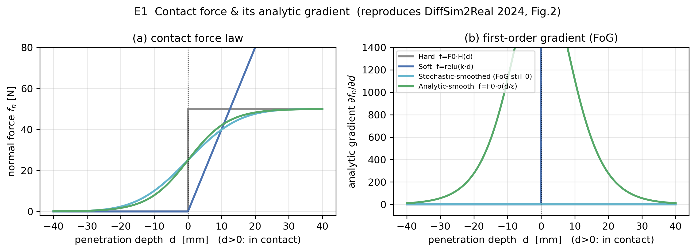

- 硬接触梯度 $\equiv 0$（`hard_grad_abs_max = 0`）、随机平滑 FoG 也 $\equiv 0$ ⇒ **一阶方法在硬接触上拿不到任何方向信息**。
- 解析平滑梯度**有界钟形**（峰值 ≈ 2083，由 $F_0/4\varepsilon$ 决定）⇒ 可用。
- **结论**：可用的接触梯度不是"免费"的，必须靠平滑（牺牲一点物理精度）换取。

### E2 Hopper 弹跳轨迹（物理正确性自检）〔实验〕

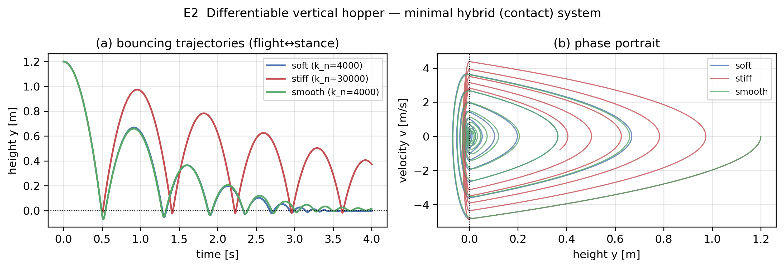

软/刚/平滑三种接触都给出正确的"自由落体—触地—回弹—衰减"，相图收敛，确认仿真可信，可作为后续梯度分析的载体。

### E3 接触粗糙化损失景观（缩微版 SHAC Fig.2）〔实验〕

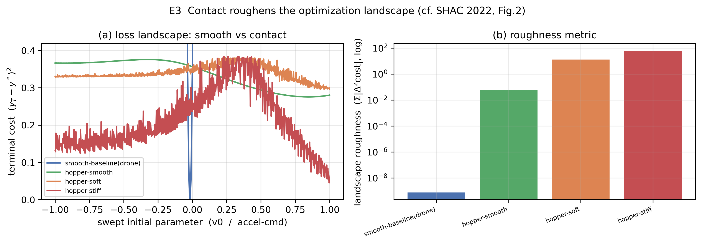

非光滑度（**三阶差分** $\sum|\Delta^3\text{cost}|$，尺度无关、对二次曲线恒为 0）：

| 配置 | 非光滑度 |
|---|---|
| 无人机光滑基线 | **7.5×10⁻¹⁰**（≈ 0） |
| hopper-smooth | 0.058 |
| hopper-soft | 13.1 |
| hopper-stiff | 62.2 |

光滑基线景观是干净抛物线；接触越硬，景观越锯齿（每个折点 = rollout 内弹跳次数/接触时序的变化）。

### E4 解析梯度(FoG) vs 有限差分"真梯度"——接触注入偏差〔实验·头条结果〕

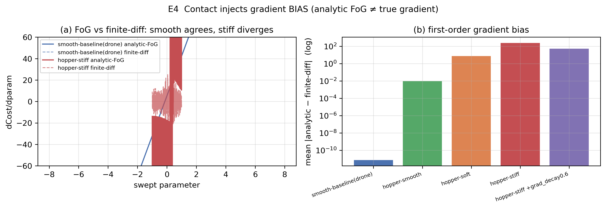

| 配置 | 平均\|解析−有限差分\| | **方向错误率**(符号不一致) |
|---|---|---|
| 无人机光滑基线 | 7.7×10⁻¹²（机器精度） | **0.0%** |
| hopper-smooth | 0.0095 | **0.0%** |
| hopper-soft | 7.34 | 48.2% |
| hopper-stiff | 241.8 | **51.9%** |

- 光滑系统：解析 FoG 与有限差分**逐点重合**，方向永远正确。
- 接触系统：解析 FoG 退化为一团噪声（图 a 红色乱线），**约一半的点梯度指向错误方向**——接近抛硬币。
- **结论**：接触注入的不只是"幅值过大"，而是**方向性偏差**。

### E5 BPTT 梯度范数 vs 视野长度（+ grad_decay 压幅）〔实验〕

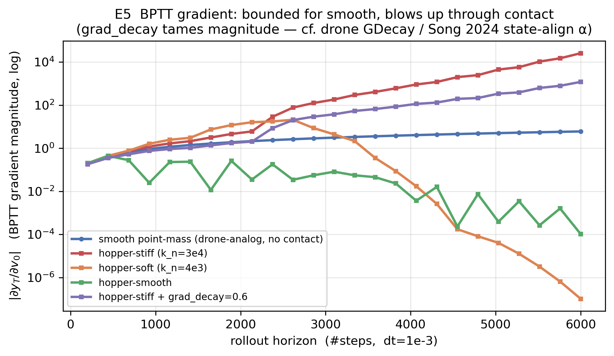

- 无人机光滑基线：$|\partial y_T/\partial v_0|$ 全程**有界** ~1–6。
- hopper-stiff：随视野**指数爆炸**至 **2.57×10⁴**（≈ 基线的 4000 倍）——SHAC ">10⁶" 现象的缩微版。
- 加 `grad_decay=0.6`：stiff 峰值压到 **1.2×10³**（×20 衰减）⇒ **梯度衰减确实压幅**。

### E6 刚度扫描（soft→hard）：粗糙度与偏差随刚度上升〔实验〕

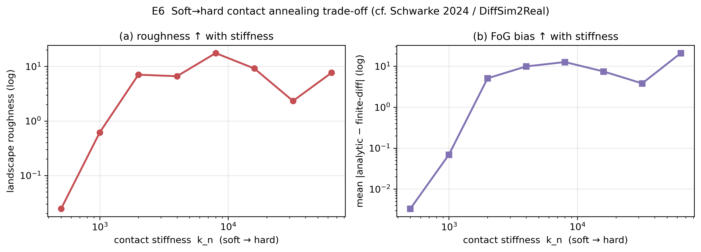

$k_n:500\to64000$，偏差从 0.003 升到 ~12.6（中段），最硬端非单调且更不稳（20.9@64000）。**接近真硬接触时 FoG 既粗糙又不稳定**——这正是 Schwarke/DiffSim2Real 主张"软→硬退火、用解析平滑而非纯硬"的实证动机。

### ★ 关键综合：grad_decay/裁剪"压幅不压偏"〔实验·推导〕

把 E4 与 E5 并读得到本阶段最重要的结论：

| | 幅值（E5 峰值） | 方向错误率（E4 符号不一致） |
|---|---|---|
| hopper-stiff | 2.57×10⁴ | 0.519 |
| hopper-stiff **+ grad_decay 0.6** | 1.20×10³（↓ 20×） | **0.519（不变）** |

**推导**：`grad_decay` 对从 $v_0$ 到终端的梯度施加**正标量**缩放 $c=\text{decay}^{dt\cdot N}>0$，而有限差分（前向）不受影响。故 $\operatorname{sign}(c\cdot\text{grad})=\operatorname{sign}(\text{grad})$ ⇒ **符号不一致率对衰减/裁剪严格不变**。全局梯度范数裁剪同理（也是正标量缩放）。

> 因此：**无人机的 GCGL 之"裁剪/衰减"能解决幅值爆炸（支柱三的失效），但在数学上不可能纠正接触注入的方向偏差（支柱一的失效）。** 纠偏必须靠**接触侧**手段：解析平滑接触、预定接触序列、短视野 + critic、或隐式可微接触。

---

## 5. 候选简化模型比较

| 模型 | 数学结构 | 可微性 | 实现难度 | 与无人机框架兼容度 | 研究价值/定位 |
|---|---|---|---|---|---|
| **垂直 Hopper / SLIP** | 1–2D，飞行↔支撑 | 平滑接触下良好〔实验〕 | 极低（已建） | 高（同 BPTT+GDecay） | **病理隔离/教学**，本阶段起点 ✓ |
| **平面 SRBM + 软接触** | 机身 3-DoF + 2–4 接触点 | 解析平滑下良好 | 中 | 高 | **保留"姿态由接触力矩产生"**，破坏平坦性的最小载体 |
| **SRBD（Song 2024）** | 浮动基 6-DoF + 力输入 | 已验证可微+可迁移〔论文〕 | 中（需步态/对齐） | 高（α衰减=GDecay） | **主线推荐**，已被真机验证 |
| **质心动力学(Centroidal)** | 质心动量 + 接触力 | 力为输入时光滑 | 中 | 中 | MPC 友好，SRBD 的近亲 |
| **残差动力学**（方向二） | $f_{\text{simple}}+r_\phi$ | 取决于 $f_{\text{simple}}$ | 中 | 中 | 物理先验+数据校正，泛化好〔猜想〕 |
| **神经代理动力学**（方向三） | $F_\phi(x,u)$ 学自仿真器 | 处处可微但**未必可信** | 高 | 中（梯度来源不同） | 高风险高回报支线，**须先验证梯度保真**〔猜想〕 |

**判断**〔综合〕：
- **第一阶段起点 = Hopper/SLIP**（已完成 E1–E6，隔离了核心病理）。
- **第一阶段主线 = SRBD/平面 SRBM + 解析平滑接触 + 预定步态**，因为它(a)是 Song 2024 已验证可迁移的路线，(b)与无人机 BPTT+GDecay 框架天然兼容（α衰减=GDecay），(c)保留了四足区别于无人机的本质——**姿态由接触力矩产生**。
- **神经代理是支线**，因为"代理可微 ≠ 真实系统可微"，须先用本笔记的 E4 式"解析 vs 有限差分"协议验证其梯度保真度，否则策略会去钻代理漏洞（见 §6）。

---

## 6. 对神经代理动力学的谨慎评估〔论文/猜想〕

必须明确区分**真实物理梯度**与**代理模型梯度**——代理网络处处可微，**不代表**它给出的梯度逼近真实系统的梯度。已知风险：

1. **梯度偏差**：代理在接触边界附近通常拟合的是"平均行为"，其梯度可能系统性偏离真实（接触本就 FoG≈0/有偏）。
2. **长程漂移**：多步 rollout 误差累积，状态离开训练分布 → 代理进入分布外区域后梯度与前向预测都需要独立验证（Song 2024 正是用非可微仿真器**状态对齐**来抑制这一点）。
3. **策略钻漏洞**：可微优化会**主动**寻找代理的低成本区，若那是模型缺陷而非真实最优，则 sim-to-sim 即崩。
4. **接触边界误差**：代理难以同时拟合"接触/非接触"两支且在边界保持正确梯度。

**与传统可微物理对照**：物理模型梯度有解析保证但接触处病态；神经代理梯度处处存在但**可信性需独立验证**。务实结论〔猜想〕：神经代理更适合做**残差**（方向二，$f_{\text{simple}}+r_\phi$）而非完全替代——保留物理先验提供"方向正确的骨架"，用数据校正幅值。

---

## 7. 验收问题逐条回答

**Q1 无人机可微框架的核心优势是什么？**
〔实验/论文〕光滑 + 可微平坦的动力学给出**低方差、方向正确**的一阶梯度（E4 方向错误率 0%、E5 幅值有界）。相比 PPO 的零阶估计，FoG 方差低、方向稳，样本效率高一个数量级以上（Song 2024、DiffSim2Real）。

**Q2 为何不能直接迁移到四足？**
〔实验〕足端接触同时破坏"光滑性"（E1：硬接触 FoG≡0；E3：景观锯齿化）与"可微平坦性"（姿态须由接触力矩积分得到），导致 FoG 在接触事件附近**既爆炸（E5 ×4000）又方向错误（E4 ~52%）**。

**Q3 四足最该保留的动力学结构？**
〔论文〕浮动基**单刚体动力学(SRBD)**：机身位置 $p$、姿态 $q$、线速度 $v$、角速度 $\omega$，以**足端接触力**为控制输入，转动方程 $\dot\omega=I^{-1}(\sum r_i\times f_i-\omega\times I\omega)$ 必须显式保留——这是与无人机点质量的本质差异。

**Q4 第一阶段最合适的简化模型？**
〔实验/论文〕病理隔离用**垂直 Hopper/SLIP**（已完成）；主线建模用 **SRBD/平面 SRBM + 解析平滑接触 + 预定步态序列**。

**Q5 神经代理动力学是否可行？**
〔论文/猜想〕可行但属高风险支线；建议先以**残差**形式（物理 SRBD + 神经修正）引入，并用 E4 式协议验证梯度保真度。

**Q6 代理模型主要风险？**
〔论文/猜想〕梯度偏差、长程漂移、策略钻模型漏洞、接触边界误差（§6）。

**Q7 GCGL 是否有迁移价值？**
〔实验〕**目标到达辅助损失可直接迁移**（密集塑形，与任务无关）；**梯度范数裁剪只能部分迁移**——E4+E5 严格证明它"压幅不压偏"（符号不一致率 0.519→0.519 不变），必须与**接触侧**手段（解析平滑接触、预定接触、短视野+critic）配合才能在四足上提供方向正确的梯度。

**Q8 下一阶段最值得投入的方向？**
〔综合〕实现"**平面四足（或 SRBD）+ 解析平滑接触 + 预定步态 + 短视野/状态对齐(α=GDecay)**"的最小可微训练闭环，复刻 Song 2024 的核心机制于本仓库 PyTorch 体系，验证"无人机 BPTT+GDecay+目标损失"配方在接触系统上的可迁移边界。

---

## 8. 下一阶段建议（按性价比排序）

1. **〔主线〕平面单刚体 + 解析平滑接触 + 预定步态的最小可微训练**：把 E1 的解析平滑接触接到一个 3-DoF 机身（x,z,θ）+ 2 足模型上，复用无人机的 BPTT 主循环、`GDecay`、目标/正则损失，验证能否学会"原地稳定/定速前进"。成功判据：在解析平滑接触下方向错误率显著低于硬接触，训练收敛。
2. **〔机制对照〕在该平面模型上量化"α状态对齐 vs 纯GDecay vs 短视野+critic"三者**对方向偏差与收敛的影响——直接产出可写进论文的对照实验。
3. **〔支线〕神经残差动力学保真度验证**：用 E4 协议（解析 vs 有限差分、符号不一致率）评估 $f_{\text{simple}}+r_\phi$ 的梯度是否可信。
4. **〔文献〕补读** Schwarke 2024(P134, 解析平滑细节)、Suh 2022 *Do Differentiable Simulators Give Better Policy Gradients?*（偏差/方差理论）、Georgiev AHAC(P128, 自适应视野)。

---

## 9. 第二阶段：平面 SRBM —— 摩擦、姿态与最小可微训练（F1–F3）

第一阶段的 Hopper 只有法向接触。第二阶段升级到**平面单刚体模型(SRBM)**：3-DoF 机身
$[p_x,p_z,\theta]$ + 2 条可控腿（棱柱伸长），加入**切向摩擦**与**姿态-接触力矩耦合**，
是 Song 2024 浮动基 SRBD 的 2D 退化。代码 [`srbm_dynamics.py`](srbm_dynamics.py)（自检：对称落地不俯仰、前腿伸长产生 +0.115 rad 俯仰、姿态对腿伸长可微可控）。

### F1 切向接触（摩擦）：平滑库仑给出可用梯度；摩擦是前向推进的唯一来源〔实验〕

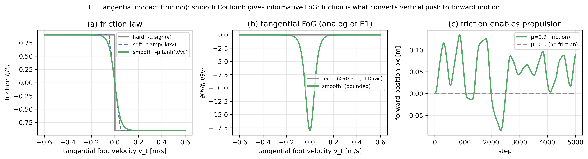

- 平滑库仑 $f_t=-\mu f_n\tanh(v_t/v_\varepsilon)$ 的切向梯度**有界**（$\max=18$）；硬库仑 $-\mu\,\mathrm{sign}(v_t)$ 的梯度**几乎处处为 0**（FoG 无信息）——这是 E1 的**切向版本**。
- 推进验证：机身初始前倾 + 双腿周期蹬伸，$\mu=0.9$ 时净前进 **0.089 m**，$\mu=0$ 时 **0 m**。**摩擦是把竖直蹬地转成水平位移的唯一机制**——无人机不需要它，四足离不开它。

### F2 姿态由接触力矩产生：可微平坦性的丧失〔实验·核心〕

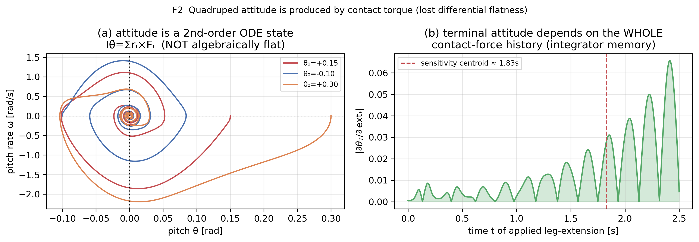

- (a) 不同初始俯仰下，$(\theta,\omega)$ 相图是**收敛螺旋**——姿态是一个**二阶 ODE 状态** $I\ddot\theta=\sum_i r_i\times F_i$（带接触恢复力矩与阻尼的阻尼振子）。这与无人机[**代数反解**姿态](../../drone_dynamics.py#L72)形成**直接对照**：无人机 $R$ 由当前推力瞬时确定，四足 $\theta$ 必须从接触力矩**积分**得到。
- (b) **可微平坦性丧失的定量签名**：终端姿态对"每一步腿伸长"的灵敏度 $|\partial\theta_T/\partial\,\mathrm{ext}_t|$ **铺满整段 2.5 s 历史**（灵敏度质心 ≈ 1.83 s），呈振荡包络——终端姿态依赖**整条接触力历史**（积分器/长记忆），而非无人机式的瞬时代数映射。**这正是"姿态不能被代数绕过、必须显式建模接触力"的数学证据。**

### F3 闭环最小可微训练（迁移"主线"的内核）〔实验〕

把无人机配方——**整段 BPTT + GDecay 梯度衰减 + 全局梯度裁剪 + 密集目标损失**——原样接到 SRBM 上：
小 MLP 策略 $[\,p_z-z^*,\theta,v_x,v_z,\omega\,]\to$ 2 腿伸长，任务是从随机俯仰/高度扰动恢复到"直立 + 目标高度"。代码 [`srbm_train.py`](srbm_train.py)。

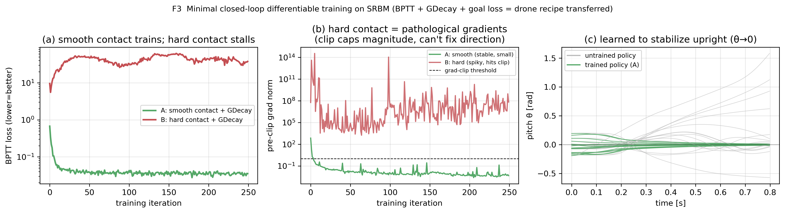

| 配置 | BPTT 损失 (初→末) | 训练中梯度范数中位数 |
|---|---|---|
| **A. 平滑接触 + GDecay**（主线配方） | 0.674 → **0.035**（↓19×，学会平衡） | **0.0096**（平稳，远低于裁剪阈值 1.0） |
| **B. 硬接触 + GDecay** | 9.58 → **37.9**（发散，训不动） | **3.04×10⁶**（峰值达 10¹⁴） |

- **(a)** 平滑接触下损失稳定下降并收敛；硬接触下损失高位震荡、始终学不会。
- **(b)** 硬接触在**真实训练循环里复现了 SHAC 的">10⁶"梯度范数现象**（中位 3×10⁶，峰值 10¹⁴），比裁剪阈值高 6–14 个数量级——裁剪把幅值封顶，但（由 E4 已证）**纠不了方向**，故训练失败；平滑接触梯度范数 ~0.01，自然平稳。
- **(c)** 训练后的策略把俯仰 $\theta$ 稳定到 0（直立），未训练策略发散。

**F3 结论**：无人机配方（**BPTT + GDecay + 目标损失 + 裁剪**）**原样接到平滑接触 SRBM 上即可训练成功**——这就是迁移主线的可行性证据；但把接触换成硬/刚，同一配方立刻失败。**可训练性的分水岭不在优化器或损失，而在接触模型是否平滑**——与 Song 2024 / DiffSim2Real 的核心主张一致。

> 附注（诚实边界）：本阶段实测中，平滑接触本身已使 BPTT 梯度有界（E5、F3-b），故 `GDecay` 在此任务上的**边际收益较小**；它的真正价值域是**刚性接触 / 长视野**（E5 红/紫曲线）。即"先用平滑接触把方向修对，再用 GDecay/短视野把幅值压住"——两者**分工互补**，对应支柱一与支柱三的不同失效模式。

### F4 前向 locomotion：预定步态 + 平滑接触 + 可微训练学会"定速前进"〔实验〕

从 F3 的**原地平衡**扩展到**定速前进**。代码 [`srbm_locomotion.py`](srbm_locomotion.py)。

**机制（Song 2024 思想的最小实现）**：
- **预定步态**：两腿反相，支撑相压腿 + 足端**向后扫**（摩擦把蹬地转成前推），摆动相抬腿前摆复位。
- **关键工程修正**：足端地面相对速度若用位置差分 $(f_x^t-f_x^{t-1})/dt$ 计算，$1/dt$（=×500）会把摩擦项梯度放大到 ~10⁵，训练无法进行；改为**解析速度** $v_{\text{foot}}=v_{\text{com}}+\omega\times r+R(\theta)\dot l_{\text{leg}}$（扫腿速度是 $t$ 的解析函数，对 autograd 梯度为 0）后，梯度范数从 8.8×10⁴ 降到 **0.32**，训练立即收敛。*（这是一条值得记录的可微仿真实现经验。）*
- **开环步态自检**（无策略）：纯预定步态即可**稳定前进 1.31 m（~0.21 m/s），高度稳定、$|\theta|_{\max}=0.10$ rad 不倒**。

**重要科学细节**：本 shuffle 步态两腿**始终轻接触、不抬腿**——因此**没有接触切换不连续**。这本身就是 Song 2024 "预定/维持接触以规避混合系统不连续"的体现；此时 smooth 与 hard 的差距主要来自接触**刚度**而非**切换**（不像 F3 的高度振荡会反复穿越接触边界）。

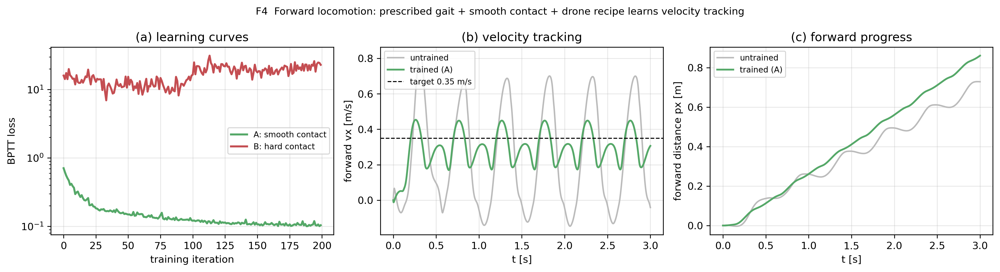

| 配置 | BPTT 损失 (初→末) | 梯度范数中位 | 前速跟踪 |
|---|---|---|---|
| **A. 平滑接触**（主线） | 0.710 → **0.104**（↓6.8×） | **0.042** | 0.235 → **0.30 m/s**（向目标 0.35 收敛），$\theta_{\max}=0.033$ rad |
| **B. 硬接触**（k_n=4×10⁴） | 16.0 → **23.0**（发散） | **6.8×10⁷** | 训不动 |

- **(a)** 平滑接触损失稳定收敛；硬接触高位震荡、学不会。两者梯度范数差 **9 个数量级**（0.04 vs 6.8×10⁷）。
- **(b)** 训练后策略把前速**紧贴目标 0.35 m/s**（均值 0.30，摆幅大减），未训练的开环步态前速在 0–0.8 间剧烈摆动。
- **(c)** 全程持续前进，且训练后机身姿态更直立（$\theta_{\max}=0.033$ rad）。

**F4 结论**：把无人机配方接到**平滑接触 + 预定步态**的 SRBM 上，小 MLP 策略**学会了定速前进**（速度跟踪 + 直立），这就是"从原地平衡扩展到 locomotion"的主线可行性证据；硬接触同任务训练失败（梯度范数 6.8×10⁷）。再次印证：**可训练性的分水岭在接触是否平滑。**

**后续支线（已记录，本阶段未延伸）**：① **状态对齐**——引入非可微高保真仿真器（IsaacGym/MuJoCo/Genesis）校正 SRBM 漂移（Song 2024 的 α 对齐，即 GDecay 的推广）；② **神经残差代理** $f_{\text{simple}}+r_\phi$——先用 E4 协议（解析 vs 有限差分 + 符号不一致率）验证其梯度保真，再决定是否替代物理项。

---

## 10. 第三阶段：神经残差动力学 —— 前向精度 ≠ 梯度保真（R1–R2）

把"物理模型 + 神经残差" $a = a_{\text{phys}} + r_\phi(x,u)$ 作为迁移支线探索。代码 [`srbm_residual.py`](srbm_residual.py)。

**设计的关键巧思**：用**参数失配**构造 teacher（数据源方案 B）——teacher = SRBM(真实参数 $m,I,k_n,k_d,\mu$ 失配)，student = SRBM(标称参数) + 加速度残差 $r_\phi$。因为 **teacher 本身就是可微 SRBM**，所以"真梯度" $J_T=\partial a_T/\partial(x,u)$ **解析可得**，于是"梯度保真"可被**直接量化**（无需真接 MuJoCo）。用前向回归（逐维归一化 MSE）训练 $r_\phi\approx a_T-a_N$。

> 形式选择：本阶段用**加速度残差**（最干净、隔离梯度保真问题）。状态残差（非物理跳变风险）、接触力残差（最贴近四足误差源，但有"脚未触地仍给力"的门控病理）留作下一步。

### R1 单步：前向精度、梯度保真、接管比〔实验〕

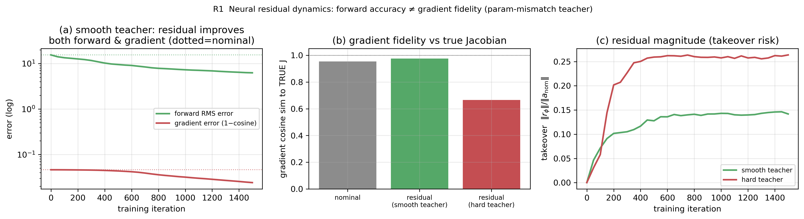

| 配置 | 前向 RMS 误差 | 梯度余弦(vs 真 $J_T$) | 接管比 $\|r_\phi\|/\|a_N\|$ |
|---|---|---|---|
| 未校正 nominal | 15.5 | 0.954 | — |
| **残差（平滑 teacher，方案 B）** | **6.3（↓2.5×）** | **0.954 → 0.976（改善）** | 0.14 |
| **残差（硬接触 teacher，方案 A）** | 13.8（几乎不降） | **0.954 → 0.666（腐蚀）** | 0.26 |

- **关键发现①（数据源决定成败）**：对**平滑**失配 teacher，残差既降前向误差又**改善**梯度保真，是**良性且有益**的；对**硬接触** teacher，残差前向几乎拟合不动，却把梯度余弦从 0.95 **腐蚀到 0.67**——正是你预判的方案 A 风险（接触边界数据非光滑）。
- **关键发现②（前向准≠梯度准）**：硬 teacher 残差**前向误差更低**（13.8<15.5）却**梯度更差**（0.67）——证明**不能用前向误差判断残差好坏**，必须独立验证梯度。
- **关键发现③（接管比可量化）**：残差幅值约占 $a_N$ 的 14%（平滑）/ 26%（硬）；teacher 越难拟合，残差越"用力"、越往"接管主模型"方向滑。

### R2 通过 rollout：梯度保真的真正考场〔实验〕

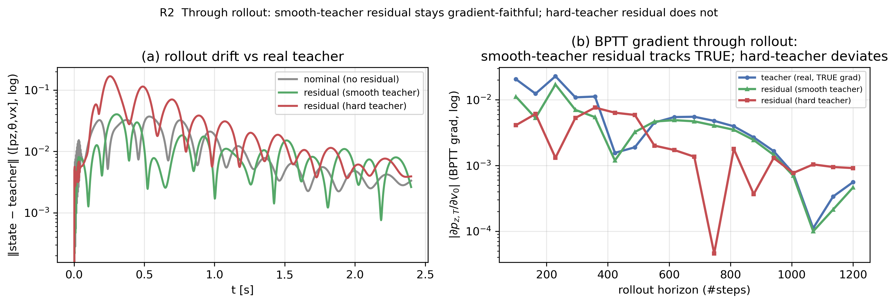

- **(a)** rollout 漂移：平滑 teacher 残差 ≤ nominal < 硬 teacher 残差（硬残差注入多步不稳）。
- **(b)** **BPTT 梯度随视野** $|\partial p_{z,T}/\partial v_0|$：平滑 teacher 残差**紧贴真值**（绿≈蓝）→ 其梯度即使经过 rollout 仍可信；硬 teacher 残差**偏离真值**（红）。这是"梯度保真"最严格的检验，因为可微训练用的正是经 rollout 的 BPTT 梯度。
- 附注：早期一次用"粗采样 + 位置差分足速"的实现里，残差 rollout 曾爆炸到 10³³——经诊断是**采样/实现伪影**（被 stiff 法向加速度主导 + $1/dt$ 放大），归一化 + 解析足速后消失。该现象表明：**残差实验的结论对采样域与实现细节高度敏感，须先把"真值梯度"和"评估协议"做干净。**

### R3 接触力残差 + 接触门控 + 法向非负约束〔实验〕

把残差从"加速度"移到**每足接触力**——最贴近四足误差源（SRBM/SRBD 的不准主要在接触侧 $k_n,k_d,\mu$）。代码 [`srbm_residual_contact.py`](srbm_residual_contact.py)。每足**共享** MLP（腿同构归纳偏置），输入 = 机身状态 + `ext_i` + 接触特征(`gap, contact_weight, foot_vn, foot_vt`) + 物理量(`F_n_phys, F_t_phys`)，输出 $(\Delta F_n,\Delta F_t)$。两条物理约束：

$$
F_n=\mathrm{clamp}\bigl(F_n^{\text{phys}}+\underbrace{\text{gate}}_{\sigma(-f_z/\varepsilon)}\!\cdot\Delta F_n,\ 0\bigr),
\qquad
F_t=F_t^{\text{phys}}+\text{gate}\cdot\Delta F_t
$$

**门控**（乘 `contact_weight`）保证离地→残差力≈0；**clamp(·,0)** 保证法向非负（不被地面"吸住"）。

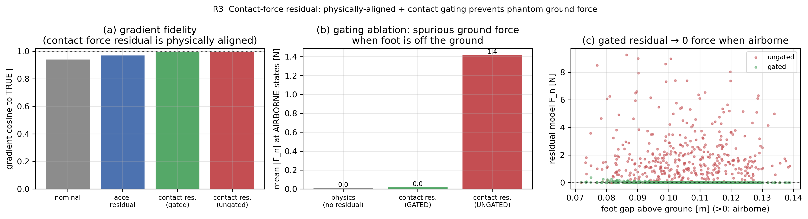

| 残差形式 | 前向 RMS | 梯度余弦(vs 真 $J_T$) | 离地幻影法向力 |
|---|---|---|---|
| 未校正 nominal | 15.9 | 0.941 | — |
| 加速度残差(R1) | 6.3 | 0.969 | — |
| **接触力残差·门控** | **3.2（↓5×）** | **0.998** | **0.017 N（≈0）** |
| 接触力残差·无门控 | — | 0.996 | **1.41 N（凭空给力）** |

- **关键发现①（形式对了，梯度更准）**：接触力残差把残差参数化在**误差真正发生的地方**，前向（3.2 vs 加速度残差 6.3）和梯度保真（**0.998** vs 0.969）**双双更优**——印证你的判断"最贴近四足误差源"不只是更物理，而是**梯度更准**。
- **关键发现②（门控的价值是结构性的）**：在**留出的"明确离地"状态集**上，物理与门控版法向力≈0，**无门控版凭空给出 1.4 N 地面力**（散点图 c 里可达 9 N）；而门控**几乎不损失梯度保真**（0.998 vs 0.996）。即**门控用零代价换来物理合法性**——离地零力是**结构保证**，不依赖训练数据是否覆盖到离地工况。
- 接管比 0.15（稳健）；法向 clamp 保证全程 $F_n\ge0$。

### R4 平滑摩擦锥 + 残差幅值限制（防接管）〔实验〕

在 R3 上再加两条**可微、结构性**的物理约束。代码 [`srbm_residual_constrained.py`](srbm_residual_constrained.py)。

$$
\underbrace{F_n=F_n^{\text{phys}}\,(1+\alpha\tanh(\Delta F_n))}_{\text{乘性有界: 非负+限幅+自门控}}\ (\alpha{=}0.6),
\qquad
\underbrace{F_t=\mu F_n\tanh\!\Big(\tfrac{F_t^{\text{phys}}+\text{gate}\cdot\Delta F_t}{\mu F_n+\varepsilon}\Big)}_{\text{平滑摩擦锥}\ |F_t|\le\mu F_n}
$$

法向乘性形式让残差**最多修正 ±60%**，结构上不可能接管/置零/吸地；切向 $\tanh$ 把力**结构性约束在摩擦锥内**。为把约束"压满"以检验其价值，这里用**更大失配** teacher（$k_n{=}1.2\times10^4$、$\mu_{\text{real}}{=}1.3>\mu_{\text{nom}}{=}0.9$）。

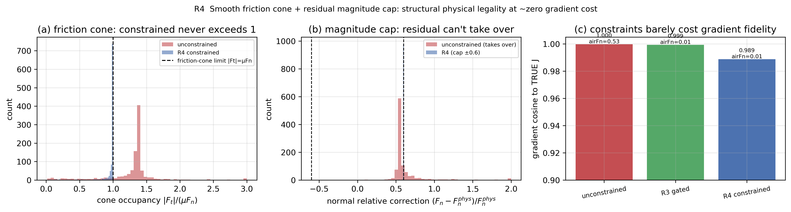

| 配置 | 梯度余弦 | 摩擦锥违反率 | 法向最大相对修正 | 离地力 |
|---|---|---|---|---|
| 无约束 | 0.9997 | **~86%**（coneMax≫1，离地处"无正压力的摩擦"）| **≈4–9×（接管）** | 0.53 |
| R3 门控（无锥/无限幅）| 0.9993 | ~81% | 0.67 | 0.013 |
| **R4 全约束** | 0.989 | **0%**（coneMax=1.00 结构封顶）| **0.60（cap 生效）** | 0.016 |

- **摩擦锥**：无约束/R3 在 80–85% 样本上违反摩擦锥（甚至在离地处给出"无正压力的摩擦"，coneMax→10⁶，完全非物理）；**R4 结构性 0 违反**。
- **幅值限幅**：无约束残差**接管**（相对修正 4.5×），**R4 结构性封顶 ±60%**。
- **约束几乎不损梯度保真**（余弦 0.999→0.989）——这正是关键：**物理合法性可以近乎零（梯度）成本地结构性获得**。
- **一个诚实代价**：R4 前向误差偏高（因为这里故意让 $\mu_{\text{real}}{=}1.3$ 超过锥用的 $\mu_{\text{nom}}{=}0.9$）——**结构约束本质是在编码先验，先验过紧（锥太小）会削掉合法力**。实践上应把锥 $\mu$ 设得**宽松（≥ 可能的真实摩擦）或可学习**。

### R5 结构性（几何）失配：足端 x 偏置如何破坏**姿态**梯度〔实验·重要〕

前面 R1–R4 都是**缩放型（参数）**失配。R5 测**结构性失配**——teacher 的脚实际落在 $r_i+\delta x$，student 以为在 $r_i$（$\delta x=0.06$ m）。同样的法向力，力矩臂 $r_x$ 不同 → 俯仰力矩 $\tau=r_xF_n$ 的**方向效应**改变，最易破坏**姿态梯度** $\partial\alpha/\partial u$ 的方向（不只是大小）。teacher/student **同参数、仅几何差**。代码 [`srbm_residual_struct.py`](srbm_residual_struct.py)。对比三模型：A=nominal，B=加速度残差，C=R4 约束接触力残差。

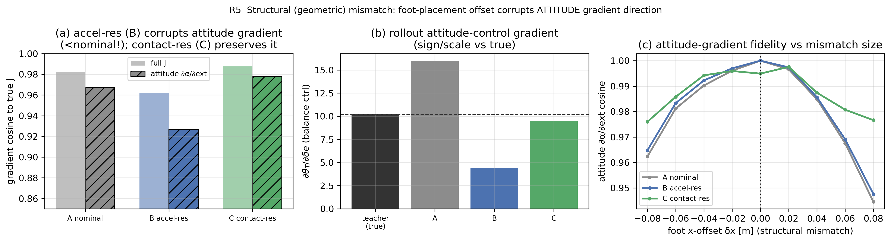

| 模型 | 前向 RMS | 全梯度余弦 | **姿态梯度余弦** $\partial\alpha/\partial\text{ext}$ |
|---|---|---|---|
| A nominal | 24.6 | 0.982 | 0.968 |
| B 加速度残差 | **10.3（前向最准）** | **0.962（↓比 nominal 还差）** | **0.927（姿态梯度被腐蚀）** |
| C 接触力残差 | 10.0 | **0.988** | **0.978（保住）** |

（注：eval 集随机，数值跨 run 有 ±0.01 波动，但三者排序稳健。）

- **核心发现（反直觉，且反转了一个naive猜想）**：几何失配下，**自由形式的加速度残差 B 前向拟合最好（10.3），却把姿态梯度余弦从 0.968 腐蚀到 0.927——比什么都不做（nominal）还差**！而**物理结构化的接触力残差 C 前向同样好，且保住了姿态梯度保真（0.978）**。
- **机理**：B 直接输出 $\Delta\alpha$ 作为状态的自由函数，能拟合 $\alpha$ 的**值**，但其**导数** $\partial\Delta\alpha/\partial u$ 不受约束、被拟合得 wiggly → 破坏姿态梯度方向；C 的修正必须经物理通道 $\tau=r_x F_n$ 流动，**物理归纳偏置约束了 Jacobian 的形状** → 即使几何失配也保住梯度方向。原先担心"C 把错误力臂焊死"，但**在此小失配（$\delta x{=}0.06$、对称）下实测物理结构的保护作用 > 错误几何的拖累**。**⚠ 适用边界（R8 将证明）**：这一保护**仅在几何失配较小、力臂符号未翻转时成立**；当失配大到翻转力臂符号（非对称 $|\delta x|>$ half\_len），C 焊死的标称力臂从"归纳偏置"沦为"错误先验"，C 反而**从最优变最差**——届时需 R9 的运动学（落足）残差。R5 与 R8 并不矛盾：分界在失配是否翻转力臂。
- **又一个"前向≠梯度"反例**，而且专打**姿态**：B 前向好却姿态梯度最差。
- 附注：单标量 rollout $\partial\theta_T/\partial\delta e$（图 b）对训练/视野较敏感（noisy），稳健结论来自 Jacobian 余弦；可稳定看到的是 **nominal 把姿态控制增益高估 ~56%**（15.97 vs 真值 10.2）。δx 扫描（图 c）显示失配越大、B 的姿态梯度保真掉得越多。

### R6 闭环验证（最终考验）：残差路线的 sim-to-sim 迁移〔实验·关键〕

R1–R5 都在**监督/回归**设定下验证残差的**梯度保真（必要条件）**。R6 测**充分条件**：用残差模型的 BPTT 梯度**训出一个策略**，部署到**真实(teacher)系统**还 work 吗？会不会钻残差的漏洞？代码 [`srbm_residual_closedloop.py`](srbm_residual_closedloop.py)。teacher 用**大失配** REAL（$m{=}16,k_n{=}1.4\times10^4,\mu{=}0.45$）。同一平衡任务，训 4 个策略（各经一种动力学），全部部署到 teacher：

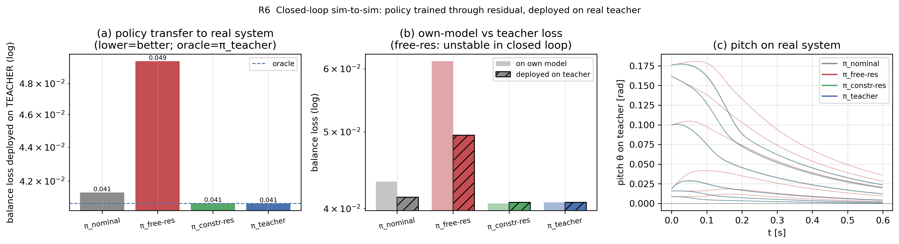

| 策略（经何种动力学训练）| 部署到 teacher 平衡 loss | 利用 gap (deploy−own) |
|---|---|---|
| π_teacher（oracle 上界）| **0.0407** | 0 |
| **π_constr-res（R4 约束接触力残差）** | **0.0407（= oracle）** | +0.0001 |
| π_nominal（无残差）| 0.0414 | −0.0019 |
| **π_free-res（自由加速度残差）** | **0.0495（最差，比 oracle 差 ~20%）** | −0.0118 |

- **核心结论①（残差路线可行）**：用**物理约束的接触力残差**训出的策略，部署到真实系统**达到 oracle 水平**（0.0407 = 0.0407），且**无利用 gap**——这是残差路线"能落地"的正面证据。
- **核心结论②（自由残差有害）**：**自由加速度残差给出最差策略**（0.0495，比 nominal 还差），其梯度/动力学误差**误导了策略训练**（quick 短训时甚至闭环 rollout 发散、loss→10⁵，与 R2 的失稳一致）。
- **核心结论③（必须物理结构化）**：贯穿 R3/R5/R6——**残差越接近物理结构、约束越足，越能给出可信梯度与可迁移策略**；自由形式在闭环里最危险。
- 诚实边界：平衡任务**反馈鲁棒**，故 nominal 也不算差（0.0414）；残差相对 nominal 的优势在此偏小，其真正价值在**更难/更模型敏感**的任务（精确轨迹/动态机动）上会放大——这是下一步该验证的。

### R7 更难任务重测：移动参考轨迹跟踪（前馈主导、多维指标）〔实验·关键〕

R6 的平衡任务**稳态反馈太鲁棒**，掩盖了模型误差（nominal≈oracle）。R7 换一个**前馈主导、模型敏感**的任务来真正分开三种残差：跟踪**移动**的高度参考 $z_{\text{ref}}(t)$ 与俯仰参考 $\theta_{\text{ref}}(t)$（正弦，$f_z{=}2.5,f_\theta{=}2.0$ Hz；幅度取小以留在残差训练域内）。**为什么更模型敏感**：跟踪移动 $z_{\text{ref}}$ 需要净法向力 $\approx m(\ddot z_{\text{ref}}{+}g)$，标称以为 $m{=}10$、真实 $m{=}16$ → 标称策略前馈力偏小 → 真机上**高度跟踪下沉**；反馈只能补稳态、补不了快参考的前馈。代码 [`srbm_residual_taskhard.py`](srbm_residual_taskhard.py)，teacher 同 R6 的大失配 REAL。四策略各经一种动力学训练同一跟踪任务，全部部署到真实 teacher：

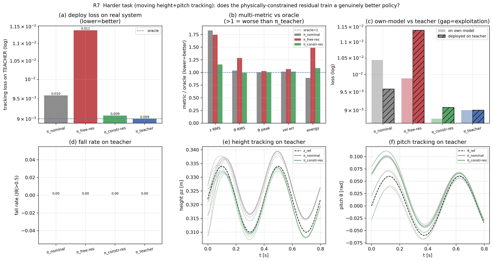

| 策略 | 部署 loss | 高度跟踪 RMS | 自模型→部署 gap | own train loss |
|---|---|---|---|---|
| π_teacher（oracle）| **0.0090** | 0.0027 | 0 | 0.0090 |
| **π_constr-res（约束接触力残差）** | **0.0091（≈oracle，且< nominal）** | **0.0031** | +0.0003 | 0.0088 |
| π_nominal（无残差）| 0.0096 | 0.0049 | −0.0009 | 0.0104 |
| **π_free-res（自由加速度残差）** | **0.0114（最差，>nominal）** | 0.0047 | **+0.0015** | 0.0099 |

- **核心结论①（残差真正增值，不只是"看起来梯度保真"）**：约束接触力残差训出的策略**不仅匹配 oracle（0.0091 vs 0.0090），还显著优于 nominal（0.0096）**——它把高度通道的 nominal→oracle 差距闭合了 **~80%**（z 跟踪 RMS 0.0049 → 0.0031，oracle 0.0027）。这直接回答你的核心追问：**物理约束残差能在更难闭环任务上训出实打实更好的策略**，而非仅梯度看着保真。
- **核心结论②（前向准 ≠ 梯度准，最严形式）**：本轮（1500 迭代）**自由残差已把前向拟合好**（own train loss 0.0099，与他人持平）——但它训出的策略**仍是最差（0.0114 > nominal），且利用 gap 为正**。即：**残差前向再准，只要梯度被腐蚀，就会训出比"什么都不做（nominal）"还差的策略**。这排除了 R6 quick 的"欠训练"解释，是 R1/R2"前向 ≠ 梯度"贯穿到闭环策略质量的**最严证据**。
- **核心结论③（排序）**：$\text{oracle} \approx \pi_{\text{constr-res}} < \pi_{\text{nominal}} < \pi_{\text{free-res}}$——结构化残差帮忙、自由残差帮倒忙。
- 诚实边界：① **姿态通道在此任务里饱和**（$\theta_{\text{peak}}$ 各策略均 ≈0.040、$\theta_{\text{rms}}$ 相近），快俯仰参考触到**控制权限上限**，反而掩盖了转动惯量失配——故本任务的模型敏感性主要落在**前馈主导的高度通道**；② **摔倒率全 0**，策略间差异是"跟踪质量"的**渐变**而非"摔倒"的突变。这本身细化了 R6 的信息：**反馈/权限受限的通道对模型误差鲁棒，前馈主导的通道才暴露模型误差**——也提示下一步该设计真正逼近权限/失稳边界的任务（如更大扰动恢复、动态机动）。

### R8 极端几何失配：力臂符号翻转**界定**"物理结构"的价值〔实验·关键·边界〕

R5 只测温和**对称**足偏（δx=0.06）。但对称平移 $fd{=}[δx,δx]$ 同时移动两脚，**差动平衡控制**力臂差 $r_{x0}{-}r_{x1}{=}2\,\text{half\_len}$ **恒定不变**——已数值验证对称失配下姿态梯度仅缓降不变号（非最狠几何失配）。**真正翻转控制方向**需**非对称"剪刀"偏置** $fd{=}[−δx,+δx]$（前脚后移、后脚前移）：差动控制增益 $g_{\text{diff}}\equiv\partial\alpha/\partial e_{\text{diff}}\propto r_{x0}{-}r_{x1}=2(\text{half\_len}-δx)$，**在 $δx{=}\text{half\_len}(0.25)$ 处过零并反号**。代码 [`srbm_residual_extreme.py`](srbm_residual_extreme.py)。

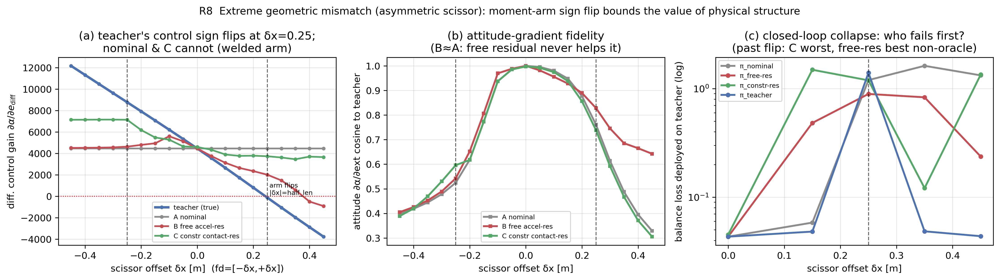

- **机理（图 a，确定性）**：teacher 的差动控制增益随 δx 单调下降、**在 δx≈0.25 处穿零变负**（δx: 0→0.45 时 $g_{\text{diff}}$ 从 +4455 降到 **−3771**，控制方向整体反转）。三种 student 响应截然不同：**A(nominal) 恒定 +4455**（力臂被焊死，永不适应）；**C(约束接触力残差) 死守正号（+3500~+4600），完全跟不上翻转**——接触力残差**只能缩放 $F_n$、搬不动接触点 $r_x$**（代码里 $\tau{=}\sum r_{x,\text{nominal}}\!\cdot\!F_n$ 用的是标称几何）；**B(自由加速度残差) 部分跟上翻转**（δx=0.40 时 $g_{\text{diff}}$ 已变负 −498），因它直接拟合前向 α。
- **梯度保真的交叉（图 b）**：姿态梯度余弦在 **δx≈±0.18 处交叉**——$|δx|{<}0.18$ 时 C 最保真（R5 结论成立），$|δx|{>}0.18$ 后 **B 反超 C**，到 δx=0.45 时 C 余弦塌到 **0.31**、B 还有 **0.64**。**R3–R7"残差越物理越保真"的结论在此被反转。**
- **核心洞见（界定主线·重要）**：力臂符号翻转是**运动学（接触点位置）**层面的失配，**力/加速度残差对它结构性无能为力**。C 焊死的标称力臂在 $|δx|{<}\text{half\_len}$ 时是有用的**归纳偏置**，一旦失配大到翻转力臂就沦为**错误先验**（C 从最优变最差）；B 虽部分拟合却又一次暴露"前向≠梯度"（前向 α 拟合上了，但 $\partial\alpha/\partial\text{ext}$ 的符号要到很大 δx 才勉强跟上、且严重滞后）。**结论：严重几何/运动学失配，需要的是修正接触点运动学的残差（或可学习落足），而非力/加速度残差**——这给"残差越物理越可信"划出了清晰边界：**前提是残差的物理结构本身近似正确**。
- **闭环佐证 + 诚实边界（图 c）**：① δx=0 时三者皆好（0.043~0.045；证实 R8 早期 δx=0 的 constr 异常只是残差欠拟合，800 迭代后消失）；② **δx=0.25 处两脚重合于质心 → 支撑多边形退化为一点 → 平衡任务对任何策略（含 oracle，loss=1.40）都不可控**，此处闭环 loss 反映**可控性丧失**而非残差质量；③ 越过奇点（δx≥0.35）支撑基以"反向"恢复，**oracle 学到反向控制能站住（0.044~0.049），nominal 因控制符号错误稳定崩溃（1.3~1.6）**；但 **B/C 排序单种子噪声大**（δx=0.35 时 C 最好 0.12、δx=0.45 时 C 又崩 1.34），故闭环只能粗验"oracle 活、nominal 崩"——**精细排残差须靠确定性的梯度量（图 a/b），而非这个反馈鲁棒 + 奇异的平衡任务**（呼应 R6/R7：平衡任务不是好探针）。

### R9 运动学（落足/接触点）残差：把残差放在**误差真正发生处**，治好 R8 的符号翻转〔实验·关键·收尾〕

R8 的诊断是：力臂符号翻转是**运动学（接触点位置）**失配，只能缩放力的 C 对它**结构失明**。R9 直接验证 R8 开出的"药方"——让残差**修正接触点位置**而非力：小 MLP 输出每足学习到的 x 偏置 $\Delta x_k$(机身状态)，用**同一套平滑接触模型**在**修正后的落足点**算力与力矩，梯度 $\partial\alpha/\partial\text{ext}$ 经**修正后的力臂**流动。代码 [`srbm_residual_kinematic.py`](srbm_residual_kinematic.py)（复用 srbm_accel 的 foot_dx 通道，残差零初始化=起点标称）。同一非对称剪刀 teacher，对比 A=nominal / C=R4 力残差（R8 的失明者）/ D=运动学残差。

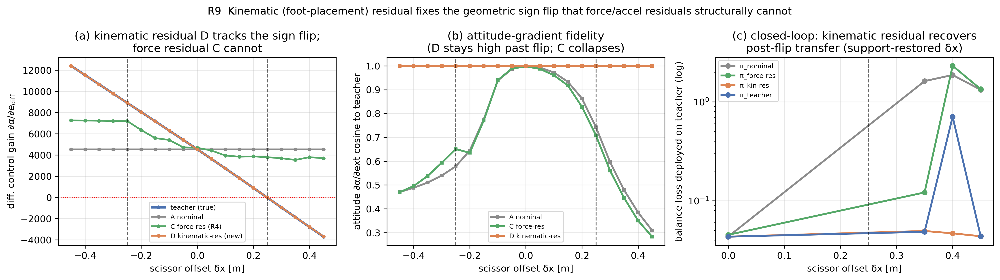

- **梯度完全恢复（图 a/b，确定性、近乎完美）**：D 的差动控制增益 $g_{\text{diff}}$ **逐点贴合 teacher**（δx=0.45：D=−3680 vs teacher=−3696，**随 teacher 一同穿零变负**），姿态梯度余弦在**全 δx 区间恒为 1.00**（C 在 δx=0.45 已塌到 **0.28**），前向 RMS 也比 C 小 1–2 个数量级（δx=0.45：D 0.30 vs C 35.4）。**因为 teacher 的失配本就是一个落足偏置，而 D 的参数化恰好精确表示落足偏置**——残差结构与误差类型对上了，前向、梯度、符号翻转**一并恢复**。**诚实边界（勿外推为"运动学残差万能"）**：D 近乎完美**部分得益于本实验的几何失配恰好是 D 假设类内的常值落足偏置**；真实场景中落足误差可能随状态/地形变化，D 只能**近似**恢复——R9 证明的是"参数化对上误差类型即可恢复梯度"，不是"运动学残差对任意几何失配都完美"。
- **闭环也完全恢复（图 c）**：**D 的策略在整个翻转后区间（δx=0.35/0.40/0.45）部署到真实 teacher 都稳定在 oracle 水平**（0.049/0.047/0.044），是**唯一能迁移过符号翻转的非 oracle**；nominal（1.3~1.9）与 C（多数点崩，0.12~2.3，单种子噪声大）皆失稳。注：D 甚至比 oracle 还稳（oracle 在 δx=0.40 撞上噪声点 0.71，D 仍 0.047），因 D≈teacher 几何、其策略训练更稳。（δx=0 时 C=0.045 已正常，证实 R8 早期 δx=0 的 C 异常确是欠拟合。）
- **收束全局原理（贯穿 R3/R8/R9·本阶段最重要的方法论）**：**残差必须参数化在误差真正发生的物理位置**。力律误差 → 接触力残差（R3：前向+梯度双赢）；几何/运动学误差 → 力残差**结构失明**（R8：从最优变最差）→ 落足/接触点残差**完全治好**（R9：梯度与闭环双双达 oracle）。"残差越物理越可信"的**完整表述**因此是：**残差的物理结构要与真实误差的类型/位置匹配**——匹配则前向与梯度俱佳、可迁移；错配则前向可凑、梯度必崩。

### R10 组合残差：力 + 运动学双头，**自动把修正路由到正确的误差通道**〔实验·关键·capstone〕

R3–R9 收束出原理：残差形式必须**对上误差类型**（力误差→接触力残差；几何误差→落足残差）。但真实迁移**事先不知道**失配是力律（参数）还是几何（接触点）。R10 给残差**两个头**——力头（R4 约束接触力残差，改"推多大力"）+ 运动学头（每足落足偏置 $\Delta x$，改"踩在哪"），让前向回归**自动分配**修正。代码 [`srbm_residual_combined.py`](srbm_residual_combined.py)（C/D/E 共用一个 `combined_accel`，只开不同头）。三种 teacher（纯参数失配 / 纯几何剪刀 δx=0.35 / 两者）× 三种 student：

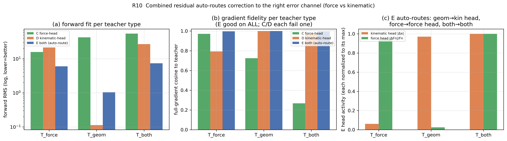

| 全梯度余弦（→teacher） | T_force（参数） | T_geom（几何） | T_both（两者） |
|---|---|---|---|
| C 力头（R4） | **0.971** | 0.724 | 0.267（姿态 **−0.10**，变号） |
| D 运动学头（R9） | 0.792 | **1.000** | 0.968 |
| **E 双头（自动路由）** | **0.996** | **1.000** | **0.995** |

- **每个单头都各栽一种失配（图 a/b）**：C（力头）治力（cos 0.971）治不了几何（0.724），在**力+几何同时失配**时姿态梯度甚至**变号**（att cos −0.10）；D（运动学头）治几何（1.00）治不了力（0.79）。**单头残差只在"猜对误差类型"时可信。**
- **双头通吃（图 b）**：E 在**三种 teacher 上全梯度余弦全部 ≥0.995**，前向 RMS 也最低——**不需事先知道失配类型**。
- **自动路由（图 c，关键）**：E 的头活跃度随 teacher 自动切换——T_force：力头满（0.57）、运动学头≈0（|Δx|=0.022）；T_geom：运动学头满（**|Δx|=0.350 ≈ 真实 δx=0.35**，连几何量都学对了）、力头≈0；T_both：两头并用。**前向回归在没被告知失配类型时，自己把修正送进了正确的物理通道。**
- **capstone 意义**：把 R3/R8/R9 的"残差须参数化在误差发生处"从"**需人先判断误差类型**"升级为"**给足通道、让数据自己路由**"——这是把前面所有洞见落到一个**实用、可迁移**残差形式上的收尾。诚实边界：本实验在监督/梯度层面证明了路由；通道更多时（地形/时延/驱动）需正则化防过参数化（与 $\mu/\alpha$ 可学习同属下一步）。

### R11 双头路由的两点加固：闭环 capstone + 正则化路由鲁棒性〔实验·关键·收尾〕

R10 在**梯度/前向**层面证明了自动路由。R11 把它做扎实两步。代码 [`srbm_residual_routing.py`](srbm_residual_routing.py)。

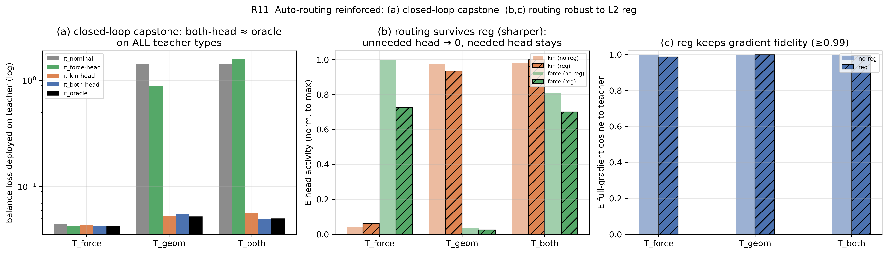

**(A) 闭环 capstone（图 a）**：三种 teacher 各经 5 种动力学训平衡策略，全部部署到 teacher：

| 部署 loss | T_force | T_geom | T_both |
|---|---|---|---|
| nominal | 0.044 | **1.43 崩** | **1.44 崩** |
| force-head | 0.043 | **0.88 崩** | **1.58 崩** |
| kin-head | 0.044 | 0.052 | 0.056 |
| **both-head** | **0.043** | **0.055** | **0.050** |
| oracle | 0.043 | 0.052 | 0.050 |

- **both-head 在三种 teacher 上全部 ≈ oracle**（0.043 / 0.055 / 0.050 vs oracle 0.043 / 0.052 / 0.050）→ R10 不只是"梯度 capstone"，而是**"闭环 capstone"**：双头策略真能迁移到**任意类型失配**的真实系统。
- **几何盲的策略（nominal、force-head）在 T_geom/T_both 上稳定崩溃**（几何翻转控制符号、非反馈可补）。诚实边界：平衡任务**对参数误差反馈鲁棒**，故 kin-head（几何对、参数错）在三种 teacher 上也都站住、T_force 上人人 ≈ oracle——**闭环的判别轴是几何**；E 相对 kin-head 的**力通道优势**体现在 R10 的梯度/前向，不在这个反馈鲁棒的平衡 loss（且闭环平衡**单种子噪声大**，呼应 R6/R8/R9，故确定性结论以梯度/路由为准）。

**(B) 自动路由非偶然——加 L2 正则仍稳且更锐（图 b/c）**：$L=L_{\text{fwd}}+\lambda_{\text{kin}}\|\Delta x\|^2+\lambda_{\text{force}}\|\Delta F\|^2$（$\lambda_{\text{kin}}{=}0.05,\lambda_{\text{force}}{=}0.02$）：

- **路由保持/锐化**：不需要的头被显式压得**更接近 0**（T_geom 力头 0.019→**0.013**），需要的头保留（T_geom 运动学头 0.35→0.33 ≈ 真实 δx；T_force 力头仍主导）；T_both 两头仍并用。
- **梯度保真不掉**：三种 teacher 下 E 的全梯度余弦正则后仍 **≥0.99**（0.986 / 0.998 / 0.996）。
- 即：自动路由**不是无约束拟合的偶然**——在"少用每个头"的显式压力下，前向回归仍把修正送进正确通道。（轻微代价：$\lambda$ 偏大时略削需要的头，T_force 余弦 0.997→0.986，提示 $\lambda$ 宜小或逐头自适应=下一步。）

### 残差选型总表（按失配类型）〔综合·核心〕

整条神经残差主线的"一图流"：**残差形式必须与失配的物理类型/位置匹配**——

| 失配类型 | 实验 | 最优残差形式 | 错配残差的失败模式 | 梯度结果 | 闭环结果 |
|---|---|---|---|---|---|
| **参数/力律失配**（$m,I,k_n,k_d,\mu$）| R1–R4, R6, R7 | **接触力残差**（R3 门控 + R4 锥/限幅）| 加速度残差前向准却梯度差（硬 teacher 余弦 0.95→0.67）；自由残差闭环最差 | 接触力残差余弦 **0.998** > 加速度残差 0.969 > nominal 0.94 | 约束接触力残差 **≈oracle**（R6 0.0407=0.0407；R7 优于 nominal）；自由残差**最差**（R7 0.0114>nominal）|
| **小几何失配**（力臂未翻转，对称 $\delta x{=}0.06$）| R5 | **接触力残差**（物理通道护住姿态梯度方向）| 自由加速度残差前向最准（10.3）却把姿态梯度腐蚀到**比 nominal 还差**（0.968→0.927）| 接触力残差姿态余弦 **0.978** vs 自由残差 0.927 | —（R5 仅梯度层面）|
| **极端几何失配**（力臂**符号翻转**，非对称 $\|\delta x\|{>}0.25$）| R8, R9 | **运动学（落足）残差**（搬动接触点 $r_x$）| 接触力残差只能缩放力、**搬不动接触点** → 结构失明、**从最优变最差**（余弦 0.28）| 运动学残差 $g_{\text{diff}}$ 随 teacher **穿零翻转**、姿态余弦**全程 1.00**；接触力残差死守正号 | 运动学残差 **≈oracle 全程**（δx 0.35/0.40/0.45）；nominal/接触力残差**崩**（1.3–1.9）|
| **未知/混合失配**（力 + 几何，事先不知类型）| R10, R11 | **力 + 运动学双头组合残差**（前向回归**自动路由**）| 单头各栽一种：力头治力不治几何（力+几何同时失配时姿态梯度**变号 −0.10**）；运动学头治几何不治力 | 双头在参数/几何/两者三种 teacher 上全梯度余弦**全 ≥0.995**；自动路由（几何 teacher 下运动学头学到 $\|\Delta x\|≈$ 真实 δx、力头≈0）| 双头**三种 teacher 全 ≈oracle**（R11 闭环 capstone）；L2 正则下路由仍稳且更锐 |

**一句话**：$a=a_{\text{phys}}+r_\phi$ 中 $r_\phi$ 的**参数化位置**决定一切——放对地方（误差真正发生处），前向与梯度俱佳、可迁移；放错地方，前向能凑、梯度必崩。不知失配类型时，给足通道、让数据自动路由。

### 第三阶段结论〔综合〕

1. **神经残差不是"通用安全"的——其梯度保真取决于 teacher 数据的光滑性**：参数失配（平滑）teacher → 残差良性且改善梯度；硬接触 teacher → 残差给"自信但错误"的平滑梯度（"代理可微 ≠ 真实可微"在此被定量复现）。
2. 直接回答你的核心关切：**最该担心的是梯度保真而非前向拟合**——R1 已给出"前向更低、梯度更差"的反例。
3. **残差形式（参数化位置）很重要**：把残差放在**接触力**上（最贴近误差源）比放在加速度上**前向和梯度双双更准**（R3：余弦 0.998 vs 0.969）。**接触门控 + 法向非负**是几乎零成本的物理约束，能结构性消除"离地幻影力"（1.4 N → 0.017 N）而不损梯度保真。
4. **接管风险可度量、可监控、可结构性封死**（$\|r_\phi\|/\|a_N\|\approx0.15$）：R4 用**乘性有界法向（±60% 限幅）+ 平滑摩擦锥**，把"残差接管"（相对修正 ≈4–9×）和"无正压力的摩擦/离地幻影力"**结构性消除**（接管→±0.6、锥违反 86%→0%、离地力→0），且**几乎不损梯度保真**（余弦 0.999→0.989）。
5. **但结构约束 = 编码先验**：若先验过紧（如锥 $\mu$ 小于真实摩擦），会削掉合法力、抬高前向误差——约束的 $\mu$/限幅应设宽松或可学习。
6. **结构性（几何）失配比参数失配更狠，且物理归纳偏置在此从"可选"变"必需"**（R5）：足端偏置等几何失配最易破坏**姿态梯度方向**；此时自由的加速度残差**前向拟合好却把姿态梯度腐蚀到比 nominal 还差**，而结构化的接触力残差**前向同样好且保住姿态梯度**——**残差越接近物理结构，其梯度越可信**（贯穿 R3/R5 的主线）。
7. **闭环最终考验：残差路线可行，但必须物理结构化**（R6）：用**约束接触力残差**训出的策略部署到真实系统**达到 oracle 水平**（0.0407=0.0407，无利用 gap）；而**自由加速度残差给出最差策略**（比 nominal 还差，短训时甚至闭环发散）。这是 R3/R5/R6 共同主线"残差越物理越可信"的闭环确证。
8. **更难任务上残差真正增值，且"前向≠梯度"被推到最严形式**（R7）：在**前馈主导**的移动参考跟踪任务上，约束接触力残差**不仅匹配 oracle、还优于 nominal**（闭合高度通道 ~80% 的 nominal→oracle 差距）；而自由残差**即便把前向拟合好，仍训出比 nominal 还差的策略**——**梯度保真（而非前向精度）才决定闭环策略质量**。诚实边界：模型敏感性集中在前馈主导通道，反馈/权限受限通道（如本任务的姿态）仍鲁棒。
9. **"残差越物理越可信"有清晰边界——前提是物理结构本身近似正确**（R8）：非对称剪刀足偏在 $δx{=}$ half_len 处**翻转差动控制力臂符号**；越过此点，约束接触力残差因**只能缩放力、搬不动接触点**而对符号翻转**结构性失明**（控制增益死守正号、姿态梯度余弦塌到 0.31），**从最优沦为最差**；自由残差反而部分跟上翻转。**力臂符号翻转是运动学失配，力/加速度残差治不了，须修正接触点运动学/落足**。闭环诚实边界：剪刀在翻转点使支撑基退化→平衡任务奇异（含 oracle 全崩），故只能粗验"oracle 活、nominal 崩"，精细排残差靠确定性梯度量。
10. **把残差放在"误差真正发生处"就能治好 R8 的符号翻转——收束全局原理**（R9）：让残差**修正接触点位置/落足**（而非缩放力），它就能在 δx=0.45 处**逐点贴合 teacher 的翻转梯度**（$g_{\text{diff}}$ −3680 vs −3696）、姿态梯度余弦**全程 1.00**、闭环部署到翻转后的 teacher **全程 oracle 水平**（唯一能迁移过符号翻转的非 oracle）。**方法论收束（R3/R8/R9）：残差的物理结构必须与真实误差的类型/位置匹配**——力误差→接触力残差、几何误差→落足残差；匹配则前向与梯度俱佳、可迁移，错配则前向可凑、梯度必崩。
11. **不知失配类型时，给残差"力 + 运动学"双头并让数据自动路由——capstone**（R10）：单头残差只在猜对误差类型时可信（力头治力不治几何、甚至在力+几何同时失配时姿态梯度变号 −0.10；运动学头反之）；**双头残差在参数/几何/两者三种 teacher 上梯度余弦全部 ≥0.995**，且**自动路由**——前向回归在没被告知失配类型时，自己把修正送进正确通道（T_geom 下运动学头学到 |Δx|=0.350 ≈ 真实 0.35、力头≈0）。把"残差须参数化在误差发生处"从"需人判断类型"升级为"给足通道、让数据路由"。
12. **自动路由是"闭环 capstone"且非偶然**（R11）：双头策略部署到三种 teacher（参数/几何/两者）**全部 ≈ oracle**（R10 从梯度 capstone 升级为闭环 capstone；几何盲的 nominal/force-head 在 geom/both 上崩）；加 L2 正则 $\lambda_{\text{kin}}\|\Delta x\|^2+\lambda_{\text{force}}\|\Delta F\|^2$ 后**路由仍稳且更锐**（不需要的头压到更接近 0、梯度余弦仍 ≥0.99）——证明自动路由不是无约束拟合的偶然。诚实边界：闭环平衡任务对参数误差反馈鲁棒（判别轴是几何）且单种子噪声大，确定性结论以梯度/路由为准。
13. **下一步**：① 让约束的 $\mu$/$\alpha$ 与各头的 $\lambda$ **逐头自适应/可学习**，防通道更多时过参数化；② 设计真正逼近权限/失稳边界的任务（大扰动恢复/动态机动），让前馈与失稳同时暴露模型误差；③ 状态对齐（非可微仿真器校正，=Song 2024 α=GDecay 推广）。

---

## 11. 复现与文件清单

| 文件 | 作用 |
|---|---|
| **第一阶段** | |
| [`slip_dynamics.py`](slip_dynamics.py) | 可微 SLIP/Hopper 动力学 + 三种接触 + 无人机式光滑基线（复用 [`drone_dynamics.g_decay`](../../drone_dynamics.py#L59)） |
| [`run_experiments.py`](run_experiments.py) | E1–E6 全部实验，生成 `figures/` 与 `results.json` |
| **第二阶段** | |
| [`srbm_dynamics.py`](srbm_dynamics.py) | 平面 SRBM（机身姿态 + 2 可控腿 + 平滑法向/切向接触 + 接触力矩） |
| [`srbm_experiments.py`](srbm_experiments.py) | F1（摩擦）+ F2（姿态/平坦性丧失），生成 `figures/F1,F2` + `results_phase2.json` |
| [`srbm_train.py`](srbm_train.py) | F3 闭环最小可微训练（原地平衡，smooth vs hard + 梯度范数） |
| [`srbm_locomotion.py`](srbm_locomotion.py) | F4 前向 locomotion（预定步态 + 闭环训练定速前进），`--openloop`/`--quick` |
| **第三阶段** | |
| [`srbm_residual.py`](srbm_residual.py) | R1–R2 神经残差动力学（加速度残差，前向精度 vs 梯度保真），生成 `figures/R1,R2` + `results_phase3.json` |
| [`srbm_residual_contact.py`](srbm_residual_contact.py) | R3 接触力残差 + 接触门控 + 法向非负（梯度保真 + 门控消融），生成 `figures/R3` + `results_phase3b.json` |
| [`srbm_residual_constrained.py`](srbm_residual_constrained.py) | R4 平滑摩擦锥 + 残差幅值限制（约束监控：锥违反/接管/梯度保真），生成 `figures/R4` + `results_phase3c.json` |
| [`srbm_residual_struct.py`](srbm_residual_struct.py) | R5 结构性（几何）失配（足端 x 偏置）下的姿态梯度保真：加速度残差 vs 接触力残差，生成 `figures/R5` + `results_phase3d.json` |
| [`srbm_residual_closedloop.py`](srbm_residual_closedloop.py) | R6 闭环 sim-to-sim：经 4 种动力学训策略、部署到真实 teacher，残差路线可行性，生成 `figures/R6` + `results_phase3e.json` |
| [`srbm_residual_taskhard.py`](srbm_residual_taskhard.py) | R7 更难任务重测（前馈主导的移动高度+俯仰参考跟踪，多维指标）：约束残差优于 nominal、自由残差前向准却最差，生成 `figures/R7` + `results_phase3f.json` |
| [`srbm_residual_extreme.py`](srbm_residual_extreme.py) | R8 极端几何失配（非对称剪刀足偏，力臂符号翻转）：界定"残差越物理越可信"的边界——约束残差对运动学翻转结构失明、从最优变最差，生成 `figures/R8` + `results_phase3g.json` |
| [`srbm_residual_kinematic.py`](srbm_residual_kinematic.py) | R9 运动学（落足/接触点）残差：修正接触点位置而非力，逐点恢复 R8 的翻转梯度（余弦全程 1.00）+ 闭环全程 oracle 水平，收束"残差须参数化在误差发生处"，生成 `figures/R9` + `results_phase3h.json` |
| [`srbm_residual_combined.py`](srbm_residual_combined.py) | R10 组合残差（力 + 运动学双头，自动路由）：3×3 teacher×student，双头在参数/几何/两者三种失配上梯度余弦全 ≥0.995 且自动把修正路由到正确通道，生成 `figures/R10` + `results_phase3i.json` |
| [`srbm_residual_routing.py`](srbm_residual_routing.py) | R11 双头路由加固：(A) 闭环 capstone（双头策略部署三种 teacher 全 ≈ oracle）(B) L2 正则下路由仍稳且更锐，生成 `figures/R11` + `results_phase3j.json` |
| [`figures/`](figures/) | E1–E6 共 6 张 300 dpi 图 |
| [`results.json`](results.json) | 全部关键数值 |
| `01_contact_gradient_pathology.ipynb` | 交互式 notebook（含解释与内联图） |

**复现命令（全部 `conda activate pytorch`、`cd research/quadruped_migration`、float64、`--device cuda:0`；各脚本可加 `--quick` 快速自检）**：

```bash
# 第一阶段 E1–E6（约 80 s）
python run_experiments.py --device cuda:0
# 第二阶段 F1–F4
python srbm_experiments.py --device cuda:0          # F1,F2
python srbm_train.py       --device cuda:0          # F3
python srbm_locomotion.py  --device cuda:0 --openloop  # F4 开环自检图
python srbm_locomotion.py  --device cuda:0          # F4 闭环训练
# 第三阶段 R1–R11（按字母序即实验序）
python srbm_residual.py             --device cuda:0   # R1,R2  -> results_phase3.json
python srbm_residual_contact.py     --device cuda:0   # R3     -> results_phase3b.json
python srbm_residual_constrained.py --device cuda:0   # R4     -> results_phase3c.json
python srbm_residual_struct.py      --device cuda:0   # R5     -> results_phase3d.json
python srbm_residual_closedloop.py  --device cuda:0   # R6     -> results_phase3e.json
python srbm_residual_taskhard.py    --device cuda:0   # R7     -> results_phase3f.json
python srbm_residual_extreme.py     --device cuda:0   # R8     -> results_phase3g.json
python srbm_residual_kinematic.py   --device cuda:0   # R9     -> results_phase3h.json
python srbm_residual_combined.py    --device cuda:0   # R10    -> results_phase3i.json
python srbm_residual_routing.py     --device cuda:0   # R11    -> results_phase3j.json
```

**种子/可复现性约定**：训练 `seed=0`、δx 扫描 `seed=1`、评估 `seed=999/123`，均固定 → **确定性实验**（R1–R5、R8/R9 的梯度扫描、R10、R11-B 路由）跨运行数值稳定（±0.01 内）。**闭环实验**（R6、R8/R9 的 Part 2、R11-A）的平衡 loss **单种子噪声较大**（已在各节标注：平衡任务反馈鲁棒 + 奇异构型），其**定性结论稳健**（oracle 活 / 几何盲策略崩 / both-head≈oracle），但**精细数值/排序勿逐位复现**——确定性结论一律以梯度/路由量为准。GPU 非确定性算子可能带来末位差异。

---

## 参考文献（本阶段精读）

- **P100** Song, Kim, Scaramuzza. *Learning Quadruped Locomotion Using Differentiable Simulation*. CoRL 2024. arXiv:2403.14864.
- **P127** Xu, Makoviychuk, Narang, et al. *Accelerated Policy Learning with Parallel Differentiable Simulation (SHAC)*. ICLR 2022.
- **P130** Bagajo, Schwarke, et al. *DiffSim2Real: Deploying Quadrupedal Locomotion Policies Purely Trained in Differentiable Simulation*. CoRL 2024 Workshop. arXiv:2411.02189.
- **P134** Schwarke, Klemm, et al. *Learning Quadrupedal Locomotion via Differentiable Simulation*. 2024. arXiv:2404.02887.（二手）
- **P131** Howell, Le Cleac'h, et al. *Dojo: A Differentiable Physics Engine for Robotics*. 2022.（二手）
- 源论文 Zhang, Hu, Song, et al. *Back to Newton's Laws: Learning Vision-based Agile Flight via Differentiable Physics*. arXiv:2407.10648.
